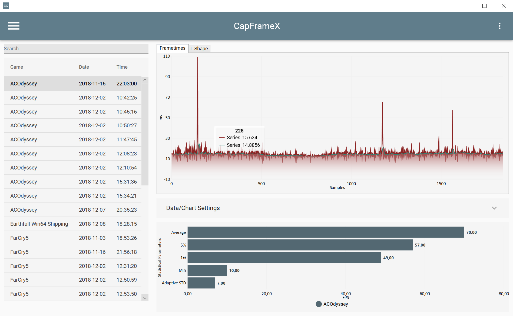

# CapFrameX
Frametimes analysis tool compatible with OCAT (in process of developing)

# Current feature list
* Automatic file record (OCAT) management/directory observer
* Selectable records in DataGrid/ searching in DataGrid
* Displaying frametime graph and moving average
* Scrollable sliding window on frametime data
* Calculating and displaying basic parameter (average, p-quantiles, min)
* Calculating and displaying adaptive standard deviation
* Calculating and displaying stuttering percentage
* Displaying system info from OCAT record file
* Removing outliers
* Calculating and displaying L-shape curve
* Minimal WiX installer

# Requirements
* .NET 4.7
* OCAT 1.3 (capturing frametime data)

# Build requirements
* MS Visual Studio 2017 only (Community Edition)
* WiX V3.11.1
* WiX Toolset Visual Studio 2017 Extension
* WiX Toolset and VS Extension: http://wixtoolset.org/releases/

# Dev roadmap
* Application architecture based on MVVM pattern und DI (done)
* UI design (work in progess)
* OCAT interface(work in progess)
* Advanced statistical methods (work in progess)
* Record comparing
* Database management
* WiX installer(work in progess)
* First beta phase
* Special features/next steps

# Special features
* Push various synthetic sequences
* Push real-world data (data from OCAT)
* Watch simultaneous live chart
* Watching smoothness/stuttering and aliasing effects at high-contrast transitions due to low FPS
* 2D/3D animation
* 3D animation using adaptive sync

