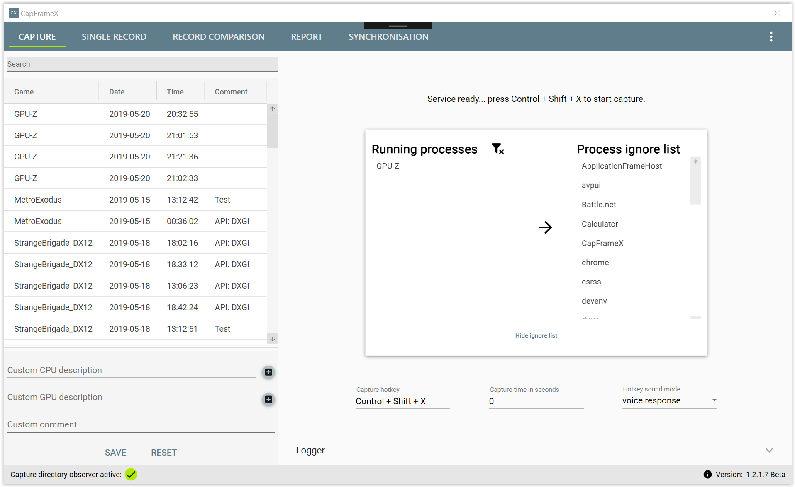

# CapFrameX
Frametimes capture and analysis tool compatible with most common 3D APIs

# Release
Download link: https://github.com/DevTechProfile/CapFrameX/releases

# Capture frametimes

# Single record analysis

# Record comparison

# L-shape analysis

# Synchronization info (G-Sync, FreeSync)

# Report table (Excel)

# Instruction manual
Learn how to use CapFrameX.

## Video tutorial
Capture page (DE): https://www.youtube.com/watch?v=ZqMMPDxJUkk

## Record list
This list is always located at the left section, regardless of the view you're currently in.
It constantly observes the output directory so every capture will show up here as soon as the capture has finished.
This also includes every OCAT capture you put into that directory.
At the bottom of that list you can see and change the CPU and GPU description, add a custom comment to each capture and also edit the game name that will be displayed throughout CapFrameX for every process. 

## Capture view
This is the default view when starting CapFrameX. Here you can set up your capture hotkey, the capture time and the response sounds.
An info text at the top always informs you what's going on with the capture service and tells you what to do.
For more detailed information about the capture events, you can take a look at the logger expander which is located at the bottom.

## How to make a capture
The process you want to capture has to be present in the "Running processes" list. This list automatically lists all running processes from which frametimes can be captured.
For the easiest way of just getting into a game and pressing the hotkey to start a capture, this list may only contain one single process, otherwise the service won't know which process you want captured.
If you have more than one process detected, you can still select the one you want and capturing will work just fine.
However you wouldn't want to tab out of your game to do this. This is where the ignore list comes into play. You can expand this list by clicking on the text at the bottom of the running processes list.
With the arrow buttons you can add or remove any process from the ignore list, the ideal scenario being a completely empty running processes list at the start of CapFrameX.
With this, you can just start your game and since it'll be the only process in the list, just push the hotkey.

## Chart control
| Action | Gesture |
| --- | --- |
Pan(Y-axis) | Right mouse button |
Zoom(Y-axis) | Mouse wheel |
Zoom by rectangle | Ctrl+Right mouse button, Middle mouse button |
Reset | Left mouse button double-click, Middle mouse button double-click, ‘A’, Home |
Show ‘tracker’ | Left mouse button |
Copy values	| Right mouse button+context menu |

You can zoom/pan/reset a single axis by positioning the mouse cursor over the axis before starting the zoom/pan.

## Single Record view
This is where you can analyse the captures you made. You can choose between frametime graphs, FPS graphs, and L-shapes.
At the bottom you have your performance parameters like min, max, avg and percentiles. These parameters can be changed in the Data/Chart settings.
You also have a pie chart which shows the amount of time you had stuttering, meaning frametimes above 2.5x average.
Also at the top you have a screenshot button to save the view(without the record list) as a png file.

Above that is the global menu.

* Moving average window size = The number of frames that are used for the average line in the frametime chart.
* Stuttering factor = The factor a frametime has to be above average to be counted as stutter.
* Observed directory = The directory in which your captures are saved and also where you can put your OCAT captures.
* FPS values rounding digits = The number of decimals for the FPS values
* Screenshot directory = The directory in which your screenshots are saved.

## Record Comparison view
Here you can compare up to 7 captures. You add the captures to the right list via drag and drop or a double-click. Above that list you can change the context that is shown for the captures and change between absolute FPS and relative percentage values.

## Report view
This is a simple view where you can add your records to see all the relevant parameters all at once. You can also just copy them with a right-click to add them into any other programm. This is also possible for the graphs and performance parameters in the single record view.

## Synchronization view
This view shows you the quality of your synchronization methods like FreeSync or G-Sync.
If they are working properly, the lines for "frametimes" and "Display changed times" should align pretty well, this means your monitor works at the adaptive refresh rate of your GPU.
At the bottom you can see the distribution of the refresh times and beside it another pie chart which shows the number of dropped frames.

# Current feature list
Capturing and analysing frametimes. Most common 3D APIs are supported. 

## Capture frametimes
* capture service based on PresentMon
* high-accurate frametime recordings
* predefined capture time
* managing processes to capture
* DirectX and Vulkan are supported
* free configurable hotkeys
* very reliable hotkey hooking

## Single record analysis
* Selectable recordings in DataGrid/ searching in DataGrid
* Displaying system info like CPU and GPU
* Editing comments and system info
* Direct editing comments and system info in record list
* Displaying frametime graph and moving average
* Displaying FPS graph and average line graph
* Cutting frametime graphs ("Single Record" page)
* Calculating and displaying basic parameter (average, p-quantiles, min)
* Calculating and displaying low average parameter (0.1% and 1% low)
* Calculating and displaying adaptive standard deviation
* Calculating and displaying stuttering percentage (time)
* Removing outliers

## Record comparison
* Record comparison (performance parameter, L-shape analysis)

## L-shape analysis
* Calculating and displaying L-shape curve

## Synchronization info (G-Sync, FreeSync)
* Displaying frametime and display changed time graph (G-Sync and FreeSync synced vs. dropped frames)

## Reporting
* Export performance parameter and graphs (Excel)
* Export comparison table as report (Excel)
* Export PNG report picture

# Requirements
* .NET 4.7.2

# Build requirements
* MS Visual Studio 2019 only (Community Edition)
* WiX V3.11.1
* WiX Toolset Visual Studio 2019 Extension
* WiX Toolset and VS Extension: http://wixtoolset.org/releases/

# Dev roadmap
* Approximation input lag
* Advanced comparison method
* Special features/next steps

