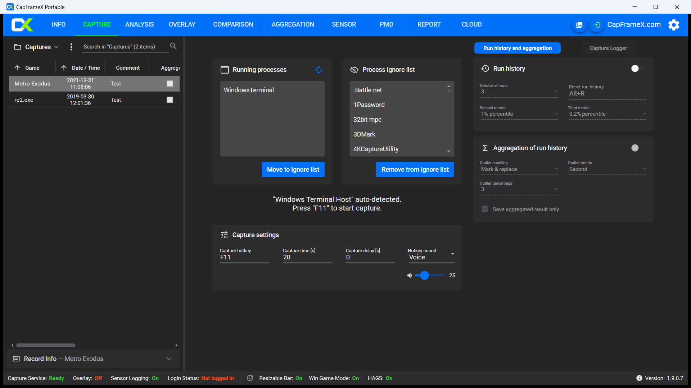
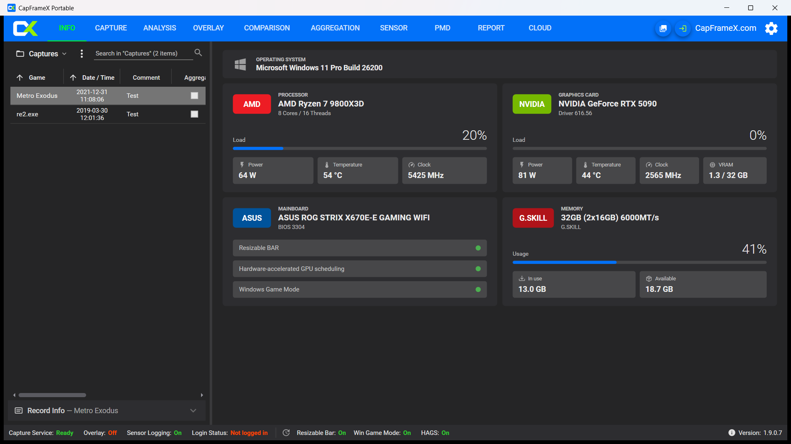
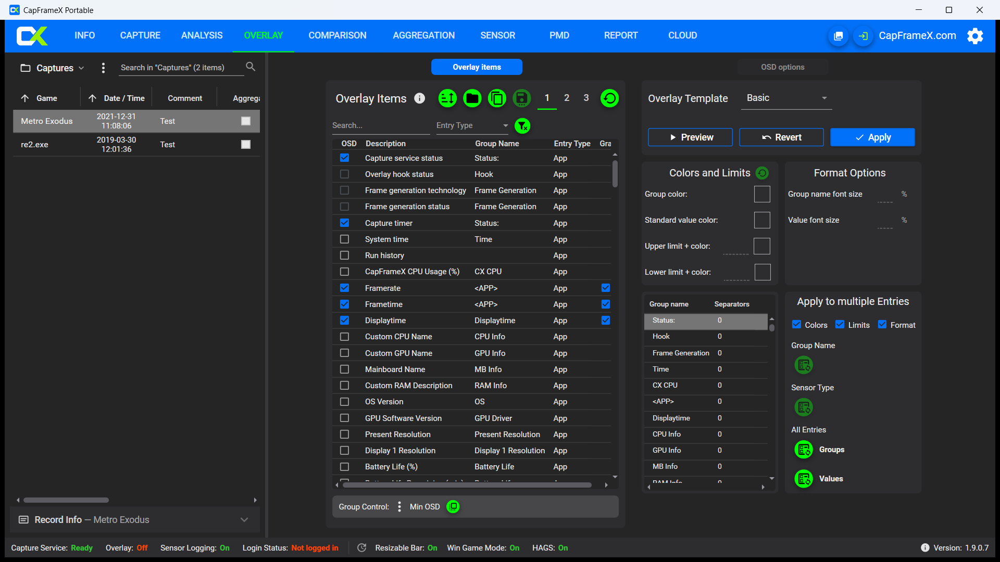
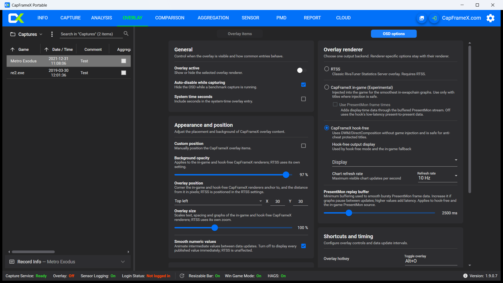
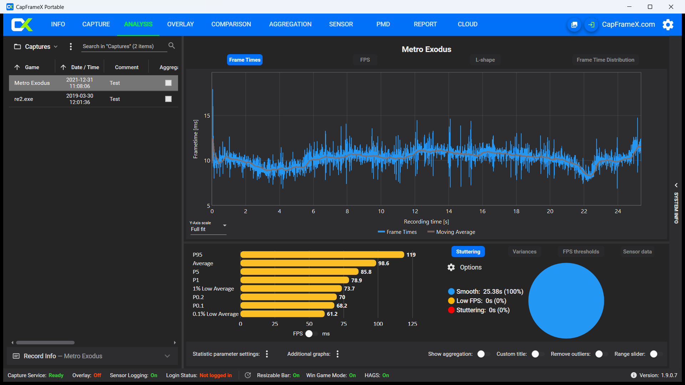
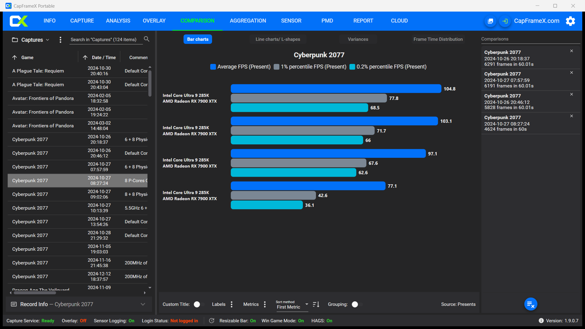
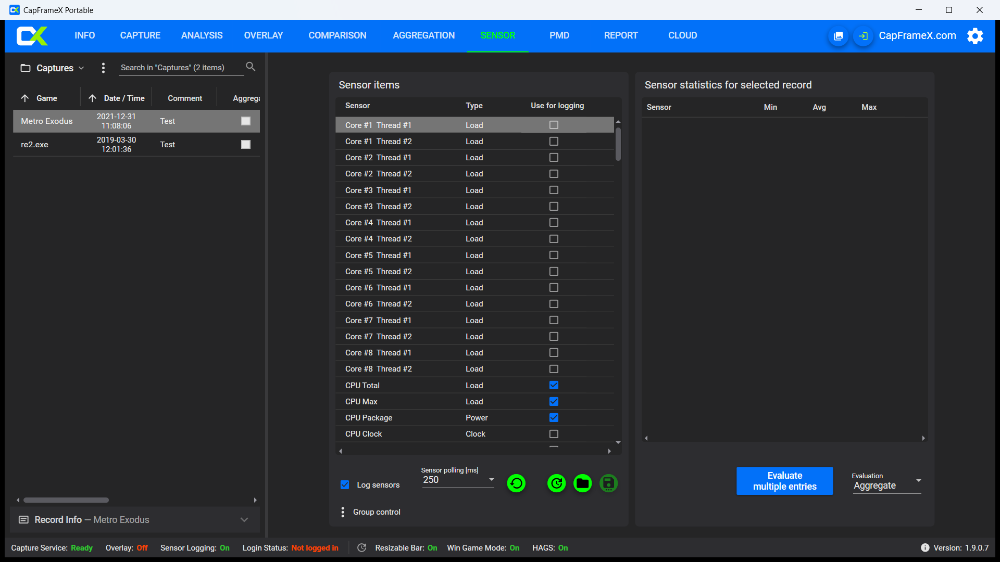
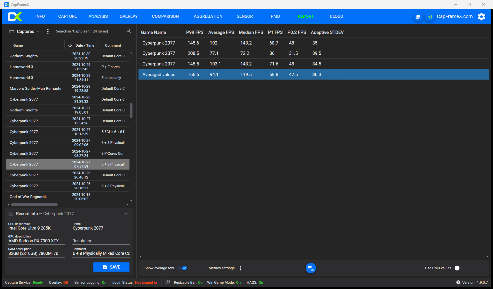
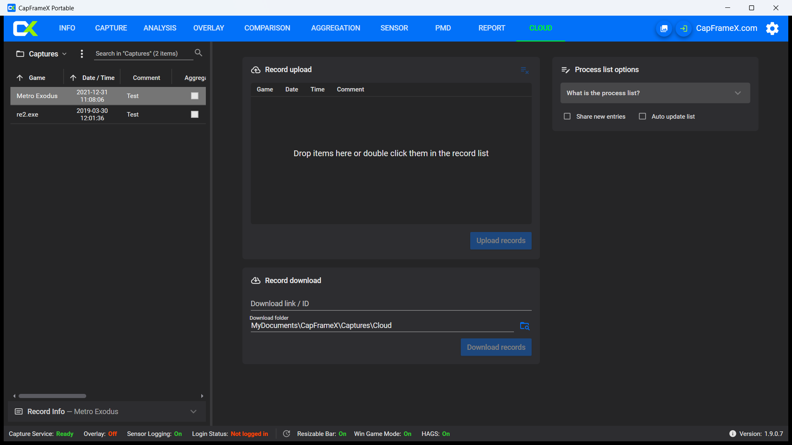

# CapFrameX
Capture, analyze, and compare game performance on Windows. CapFrameX combines Intel's [PresentMon](https://github.com/GameTechDev/PresentMon) with hardware monitoring, frametime and FPS charts, and configurable overlays.

Version **1.9.0** introduces a refreshed interface, a system information dashboard, a built-in hook-free overlay, expanded GPU telemetry, and lower background polling overhead. The application now runs on **.NET 10**.

This branch develops **1.9.1.0-beta**. It enables the experimental in-game overlay again and includes the DirectX hook and Vulkan layer DLLs for both x64 and x86, plus the bundled BENCHLAB service, in installer and portable builds. Compatible separately installed BENCHLAB services remain supported. The installer registers each Vulkan layer in its matching HKLM registry view.

# Remark in our own interest
If you are a reviewer or a youtuber using CapFrameX to get your data, it would be nice to mention us and link to our software.
If you want to use images of the CapFrameX analysis, you could use the built in screenshot function so that our logo and name gets added to the images.

# Release

Download **[CapFrameX v1.9.0](https://github.com/CXWorld/CapFrameX/releases/tag/v1.9.0)**:

The revised packages contain application version **1.9.0.8**. The CapFrameX in-game overlay is disabled and its injection components are omitted until our code-signing certificate is available. BENCHLAB monitoring remains available with a separately installed compatible service; the service is no longer bundled.

When replacing an earlier 1.9.0 portable package, extract this revision into a **new folder** and copy over your `Portable` data folder if needed. This prevents old hook, Vulkan, or service files from remaining beside the new application.

| Package | Use |
| --- | --- |
| [Installer](https://github.com/CXWorld/CapFrameX/releases/download/v1.9.0/release_1.9.0_installer.zip) | Extract the ZIP and run `CapFrameXBootstrapper.exe`. Setup installs the application and removes obsolete CapFrameX Vulkan layer registrations. |
| [Portable](https://github.com/CXWorld/CapFrameX/releases/download/v1.9.0/release_1.9.0_portable.zip) | Extract the complete ZIP and run `CapFrameX.exe`. Keep `portable.json` beside it to store settings, captures, and logs in the portable folder. |

Install the **[.NET 10 Desktop Runtime (x64)](https://dotnet.microsoft.com/download/dotnet/10.0)** before running setup or the portable application. The Desktop Runtime is required even if another .NET version or the plain .NET Runtime is already installed.

See the [release notes](https://github.com/CXWorld/CapFrameX/releases/tag/v1.9.0) for changes and package checksums, [Portable Mode](PORTABLE_MODE.md) for configuration, and [all releases](https://github.com/CXWorld/CapFrameX/releases) for older versions. Development builds are available from the [build archive](https://archive.capframex.com/).

# Troubleshooting & Known Issues
The following tips address the most common issues reported by users and can help resolve stability, overlay, and capture-related problems efficiently. We recommend working through them in order if you encounter unexpected behavior.

1. **Ensure you are running the latest version**  
   Install the latest [stable release](https://github.com/CXWorld/CapFrameX/releases/latest) and its required .NET Desktop Runtime. Version 1.9.0 requires **.NET 10 Desktop Runtime (x64)**; the installer checks for it before proceeding.

2. **Reset application settings**  
   In some cases, corrupted or outdated configuration files may cause problems. Close CapFrameX, back up your configuration, and rename
   `%appdata%/CapFrameX/Configuration/AppSettings.json`  
   to let CapFrameX recreate its default settings on the next start. In portable mode, use the configuration folder specified in `portable.json` instead.

3. **Reset overlay configuration files**  
   If overlay-related problems persist, close CapFrameX and back up or rename the overlay configuration files located at
   `%appdata%/CapFrameX/Configuration/OverlayEntryConfiguration_(0/1/2).json`.  
   These files will be recreated automatically on the next application start.

4. **Restore missing or zero-value overlay entries**  
   When overlay entries are missing or display constant zero values, open the **Overlay** tab and use the **Reset** button to restore all overlay entries to a valid default state.

5. **Fix incorrect overlay entry order**  
   If the order of overlay entries appears inconsistent or unintentionally rearranged, use the **Sort** button in the **Overlay** tab to restore a clean and logical ordering.

6. **Resolve frametime anomalies after updates**  
   Close CapFrameX and any other capture tools before updating. If a capture service remains running after an application has exited, close its leftover **PresentMon** process before starting a new capture session.

7. **Avoid conflicts with other monitoring tools**  
   Applications such as **HWiNFO** or **AIDA64** that implement their own FPS or frametime metrics may conflict with CapFrameX’s capture service, as they also rely on PresentMon-based mechanisms. Disabling overlapping FPS or frametime monitoring features in those tools is strongly recommended when using CapFrameX.

# Capture frametimes

Configure the capture hotkey, duration, sensor logging, and run history. The process list determines which application is captured.



# System information

The Info tab brings together CPU, GPU, memory, and mainboard details with live telemetry and system features such as Resizable BAR, HAGS, and Windows Game Mode.



# Overlay

Choose a renderer under **Overlay → OSD options**. The following describes 1.9.1 development builds; the screenshots show the stable 1.9.0 release.

| Renderer | Behavior |
| --- | --- |
| **CapFrameX hook-free** | Built-in overlay without injecting into the game. This is the default for new configurations and offers an output-display picker and chart refresh control. |
| **CapFrameX in-game (Experimental)** | Enabled in 1.9.1 development builds, with DirectX and Vulkan integration, game compatibility profiles, and hook-free fallback routing. Unavailable in the stable v1.9.0 packages. |
| **RTSS** | Uses [RivaTuner Statistics Server](https://www.guru3d.com/content-page/rivatuner.html), which must be installed separately. |

Configure individual entries, colors, groups, and three profiles in **Overlay items**. OSD options include opacity, zoom, placement, a position hotkey, and PresentMon replay buffering. Existing renderer selections are preserved. If v1.9.0 migrated your in-game selection to hook-free, you can select in-game again in 1.9.1.




# Analysis

Inspect frametimes, FPS, percentiles, stuttering, distributions, and recorded sensor data for an individual capture.



# Aggregation

Combine multiple runs using their raw frametimes, with configurable outlier handling. Aggregation is available for recorded captures and directly from the capture run history.

# Comparison

Compare captures using bar charts, time series, distributions, and variance views. Select metrics and labels, sort results, and highlight individual series.



# Sensor

Choose which available CPU, GPU, memory, and storage sensors to record. Version 1.9.0 adds GPU memory allocation telemetry, NVIDIA memory temperature and estimated bandwidth readings, and AMD Anti-Lag/FLM integration on supported hardware.



# Report

Collect selected captures in a table, choose the reported metrics, and display an average row. Copy the results from the context menu to use them in Excel or other tools.



# Cloud

Share captures through upload IDs and download shared records for local analysis.



# MCP Server (AI integration)

CapFrameX ships an in-process MCP server that lets compatible AI clients read recorded captures, compute statistics, diagnose issues, and query the live system. It also exposes tools to start and stop captures and update application, overlay, and sensor settings. The server runs only while CapFrameX is running and is reachable on `http://localhost:<WebservicePort>/mcp` (default port `1337`; if taken, CapFrameX falls back to a free port and persists the choice in `AppSettings.json`).

No additional install. The MCP server is part of `CapFrameX.exe`.

## Setup with Claude Code

1. Make sure CapFrameX is running.
2. Look up the active port in `%appdata%/CapFrameX/Logs/CapFrameX.log` (search for the line `MCP endpoint available at http://localhost:<port>/mcp`) or open `%appdata%/CapFrameX/Configuration/AppSettings.json` and read `WebservicePort`.
3. Register the server with Claude Code (one-time):

   ```bash
   claude mcp add -s user capframex --transport http http://localhost:<port>/mcp
   ```

4. Verify:

   ```bash
   claude mcp list
   ```

   Expected:

   ```
   capframex: http://localhost:<port>/mcp (HTTP) - ✓ Connected
   ```

5. In any new Claude Code session, type `/mcp` to see the server in the active connection list. The tools become available to the model.

If CapFrameX is not running, the connection appears as **disconnected**. Start CapFrameX and the connection comes back live.

## Setup with Claude Desktop

Add this to your `claude_desktop_config.json` (Settings → Developer → Edit Config):

```json
{
  "mcpServers": {
    "capframex": {
      "url": "http://localhost:<port>/mcp"
    }
  }
}
```

Restart Claude Desktop. The CapFrameX tools appear in the MCP picker.

## Available tools

| Tool | Purpose |
| --- | --- |
| `cfx_ping` | Connectivity check (returns `pong`). |
| `cfx_list_records` | Lists capture records from the configured directory; optional substring filter on game/process. |
| `cfx_get_record` | Full metadata of a record (system info, run count, settings). |
| `cfx_search_records` | Free-text search across game/comment/CPU/GPU/OS/RAM. |
| `cfx_get_metrics` | FPS metrics (Average, P1, P0.2, Min, Max, AdaptiveStd, …) — single run or all runs. |
| `cfx_compare_records` | Side-by-side metric table across multiple records with absolute and percentage deltas. |
| `cfx_get_sensor_summary` | Per-sensor avg/min/max for CPU/GPU/RAM/VRAM channels. |
| `cfx_analyze_bottleneck` | Classifies a run as cpu-bound, gpu-bound, balanced, thermal-throttling, or power-limited (with confidence + reasoning). |
| `cfx_diagnose_capture` | Scans recent log entries for capture-related failures. Pattern library: ETW conflicts, anti-cheat, permissions, PresentMon errors, blacklisted processes, etc. |
| `cfx_diagnose_general` | Same as above but with focus area (`capture` / `sensors` / `overlay` / `all`). |
| `cfx_get_capture_timeline` | Chronological capture-related events from the log (hotkey, PresentMon start/stop, session save, errors). |
| `cfx_get_current_system` | Live system info: CPU, GPU, RAM, OS, motherboard, Resizable BAR (HW + D3D + Vulkan), HAGS, GameMode, PCI BAR sizes. |
| `cfx_get_capture_status` | Read-only capture state: isCapturing, isLocked, current state (Started, Processing, Stopped, …). |

The table above covers analysis and diagnostics. Additional tools include `cfx_list_processes`, `cfx_start_capture`, `cfx_stop_capture`, `cfx_get_config`, `cfx_set_config`, `cfx_get_overlay_entries`, `cfx_set_overlay_entry`, and `cfx_set_logged_sensors`. Capture-control and configuration tools change application state; the MCP interface is not read-only.

## Example interactions

Ask Claude in natural language. Below are three concrete examples that exercise multiple tools.

### 1. "Compare my last three Cyberpunk records"

Claude internally calls `cfx_search_records` with `"Cyberpunk"`, takes the three most recent ids, then calls `cfx_compare_records` with default metrics (Average, P1, P0.2, Min, Max). Output: a tabular comparison with deltas highlighting which run was best/worst.

### 2. "Why is the latest Spider-Man 2 capture only at 80 fps?"

Claude calls `cfx_list_records` filtered by Spider-Man, picks the newest, then calls `cfx_get_metrics` to confirm the average, `cfx_get_sensor_summary` to see CPU/GPU load, and `cfx_analyze_bottleneck` to get a verdict. Typical answer: *"GPU load averaged 74 %, CPU max-thread load 82 % — the run is CPU-bound; this is consistent with Spider-Man 2's known DX12 main-thread bottleneck."*

### 3. "My benchmark didn't get recorded. Why?"

Claude calls `cfx_diagnose_capture` (default 30-min lookback) and `cfx_get_capture_timeline`. Typical findings: an ETW session conflict (FrameView SDK still installed), a blacklisted process, missing administrator rights, or an anti-cheat that blocked PresentMon — each with a concrete suggested fix.

## Configuration

In `%appdata%/CapFrameX/Configuration/AppSettings.json`:

| Key | Default | Effect |
| --- | --- | --- |
| `McpEnabled` | `true` | Toggle the MCP module on/off. When `false`, the rest of the local API still runs. |
| `WebservicePort` | `"1337"` | Shared with the existing local API. The MCP endpoint lives at `/mcp` on that same port. |

To disable MCP: set `McpEnabled` to `false` and restart CapFrameX. Logs related to the MCP server appear in the standard CapFrameX log file (`%appdata%/CapFrameX/Logs/CapFrameX.log`).

# Instruction manual
Learn how to use CapFrameX.

## Record list
This list is always located at the left section, regardless of the view you're currently in.

It constantly observes the output directory so every capture will show up here as soon as the capture has finished.
This also includes every OCAT or PresentMon capture you put into that directory.

Changing directories:  
Click the folder breadcrumb above the record list to open the folder popup. Select the root capture folder or browse its subfolders without resizing the record list.
Use the tree view's context menu to create or delete subfolders or open a folder in Explorer. You can also move record files through the context menu in the record list itself.

Changing record info:  
At the bottom of the record list you can see and change the CPU, GPU and RAM description and add a custom comment to every capture.
Also you can edit the game name, since the process name is used as default. 
This gets saved in a process list file that is being compared with a list we update on every new version of CapFrameX to add new games that aren't already on your list. 

## Global Navigation Bar
Located at the top  
Contains all the different views, a screenshot button, a login button (for additional cloud services), a direct link to the CX website and an options menu. 
The screenshot button takes a screenshot of the current view excluding the record list.

## Settings (Options)

* Graph filter window size = The time period in which the filtered FPS graphs are being averaged (Analysis & Comparison View)
* FPS values decimals = The number of decimals for the FPS values
* Screenshot directory = The directory in which your screenshots are saved. 
* Use "MsBetweenDisplayChange" metrics. Uses display times for metric calculation. Enable this option when analyzing displayed frames with Frame Generation.
* Use PC Latency. Still beta state. Disable if you encounter frame time issues. Restart CapFameX after changing the option.
* Capture file mode = How capture files are saved  
  JSON: Standard JSON file  
  JSON + CSV: Additional CSV file that won't be used by CX but can be opened to get a better view on the raw PresentMon data  

## Settings (Hardware)

* Primary Graphics Adapter. Select the primary graphics adapter for sensor and overlay management. Auto (default) removes iGPU when it least one dGPU is detected.
* Hardware info source = What will be written into the capture file as your CPU, GPU and RAM config.  
  Automatic detection: What's delivered by the system  
  Custom description: What you write into the text boxes below
* Use "TBP Sim" sensor values (AMD graphics cards) if available

## Settings (App)

* Start with windows & Start minimized = Autostart option and starting in tray
* "Dark Mode" UI color mode
* Receive notifications to get important information about the software and the project

## Capture view
Here you can set your capture hotkey, the capture time (0=unlimited), choose if and how precisely you want to log sensor data (like CPU/GPU load and power) and set the hotkey response sounds.  
An info text always informs you what's going on with the capture service and also tells you what to do in certain situations.
For more detailed information about the capture events, you can take a look at the capture logger on the right side.

Run history and aggregation options  
Run history to set a number of runs for which you get a simple analysis directly in the OSD. If the history is full, any additional run will replace the oldest one.   

Aggregation to combine the runs in the history to a single record file once the history is full, while marking outliers within the history.  
This doesn't take the calculated performance parameters of each record file and calculates an average out of them. It takes the raw frametimes of each record file and puts them into a new file, calculating every parameter based on that set of frametimes.  
Aggregation outlier handling: A full history is checked for outliers using the median of a selectable metric and an also selectable percentage value.

"Mark & use": Outliers are marked, but all runs will be used for the aggregation.
	
"Mark & replace": If outliers exist, you have to do additional runs to replace them. Aggregation triggers when you have a full history without outliers.  
	
"Save ggregated results only" to only keep the final aggregated file on your drive. If unchecked, every single capture will be saved alongside the aggregated one.


## How to make a capture
The process you want to capture has to be present in the "Running processes" list. This list automatically lists all running processes from which frametimes can be captured.

For the easiest way of just getting into a game and pressing the hotkey to start a capture, this list may only contain one single process, otherwise the service won't know which process you want captured.
If you have more than one process detected, you can still select the one you want and capturing will work just fine.
However you wouldn't want to tab out of your game to do this. This is where our ignore list comes into play.

With the buttons below the two lists you can add or remove any process from the ignore list, the ideal scenario is a completely empty running processes list at the start of CapFrameX.
With this, you can just start your game and since it'll be the only process in the list, just push the hotkey.  
In case a process wasn't detected correctly you can try to rescan processes with the button at the top of the running processes list.

The ignore list entries are drawn from the same process list that contains your game names, which gets updated with our own list on every new Version of CapFrameX.


## Overlay view
Contains the settings for the items displayed in the OSD as well as the settings for a run history and the aggregation function.  

Left side  
Overlay items list where you can set the items you want to see in the OSD and change their order by drag and drop. Items with the same group name will be displayed within a single line.
Three profiles to save different overlay configurations.
The overlay hotkey shows or hides CapFrameX's OSD. With the RTSS renderer, it controls CapFrameX's entries without hiding entries provided by other applications.

Right side  
Overlay items options  
Here you can set colors, limits and font sizes for each individual overlay entry. The currently selected entry is always displayed at the top.  
If you want to apply one or more of these settings to multiple entries, e.g. red color above a limit of 95 for all CPU thread loads, you can set them for one entry and then click on the "Sensor type" button at the bottom right side.
This will apply the settings for all entries that are CPU loads. The same is possible for entries with the same group name, e.g. if you want a certain group color for all entries with group name X.
The group name or sensor type for which settings are applied is always displayed next to the buttons.  
At the bottom left side you can set separators for all currently used group names, setting one separator for a group results in an empty line above that group.

## Analysis view
This is where you can analyse the captures you made one by one.

At the tops you can choose between frametime graphs, FPS graphs and L-shapes.  
For the frametime graphs you can set a y-axis scale so that you are always looking at the same ms range for each record.  
For the FPS graphs you can choose a filter mode so that you can either see the raw FPS data or a time based average filter to see a more clear FPS trendline.
Below that you have your performance parameters like min, max, avg and percentiles on the left.  
On the right you have three tabs, the first one is a pie chart which shows the amount of time you had stuttering (frametimes above 2.5x average (default)) or low FPS (frametimes above converted 25FPS (default)), the second one is a diagram where you can see how many frames were below or above specific FPS thresholds.
If you chose to log sensor data for a record, two additional options are enabled: You can see the min, avg and max values of some basic sensors over the course of the benchmark as well as adding additional graphs to show you CPU and GPU load directly in the frametime chart.  
At the bottom is a toolbar where you can change the performance parameters, toggle the additional sensor data graphs, remove unusual outliers from the graphs and activate a range slider that you can also use to cut a record and saving it as a new file.
On the very right side of the page, there is a "System info" expander which shows all the HW and SW information available for the selected benchmark.

## Aggregation view
Here you can manually aggregate records that were already saved.
Add them to the list and set the metrics you want to be displayed as well as the outlier handling options.
Outliers will be marked red and you can choose to include or exclude them for the aggregation. On aggregation you'll see a simple result line and a new record file is created containing all the frametime data of the aggregated records.

## Comparison View
Here you can compare multiple records.  
With a double-click from the record list you can add the captures to the comparison list and with a click on the comparison list entry you can select them in the record list. With the button at the end you can remove them all from the list.

The first tab shows you the records as bar charts.  
If you compare records from just a single game, this game is set as a title above the diagram. If you compare records from multiple games, the names are labeled on the bars.
In addition you have two adjustable contexts that are set as labels for each record.
At the bottom is a toolbar where you can change the sorting and adjust the displayed metrics as well as the contexts.  
For screenshot purposes you can activate "Custom title" to type in a title at the top yourself.
The "Grouping" toggle switches between two sorting modes:  
off-> all records are sorted by FPS  
on-> records are sorted by game, then by FPS  

The second tab shows you the frametime + FPS graphs and L-shapes.  
You can highlight the graphs with a mouseover in the comparison list and also change their color or hide them.
The toolbar now shows you the options to activate the range slider and the context legend for the frametime graphs. The context setting is shared between the two tabs.

## Chart control
| Action | Gesture |
| --- | --- |
Pan | Right mouse button, arrow keys(+ Ctrl = slow pan) |
Pan(X-axis) | Shift + right mouse button |
Pan(Y-axis) | Ctrl + right mouse button  |
Zoom | Mouse wheel |
Zoom(X-axis) | Shift + mouse wheel |
Zoom(Y-axis) | Ctrl + mouse wheel |
Zoom by rectangle | Middle mouse button |
Reset | Left or middle mouse button double-click, ‘A’, Home |
Show ‘tracker’ | Left mouse button |
Copy values| Right mouse button context menu |

You can also zoom/pan a single axis by positioning the mouse cursor over the axis before starting the zoom/pan.  
This manual is also available through the context menu.

## Sensor View
In this view you can choose to log sensor data along with your frametimes. You can freely select any number of sensors available and when selecting a record that contains sensor data, all sensor values are displayed in the list on the right.
These values can be copied to clipboard via context menu, either as min/avg/max values like seen in the list or as raw values with every single sensor reading included.

## Report view
This is a simple view where you can add your records to see all the relevant parameters all at once. You can also just copy them with a right-click to add them into any other program. This is also possible for the graphs and performance parameters in the single record view.

## Cloud view
In this view you can upload and download records to easily share them with others.

To upload records, add them to the upload list and click the upload button. Once the upload is complete, you'll get an ID that others can use to download your records in the download section below.
To download records, just add the ID and click the download button.

If you log in before the uploads, you can see all your uploads and IDs on capframex.com. 
The optional description next to the upload button is to name your upload to easily find them on the website. It doesn't have any effect if you're not logged in.

If you activated the process list options on the right, new game names you add and new processes you ignore can be automatically added to our online list and your own list can be synced with that online list so that you always get the latest entries.
This doesn't affect any processes you already have on your list. If our online list contains the same process as yours but with a different game name, your entry will not be changed. The same goes for the ignored status of a process.

## Export options (context menu)
* Analysis: frametime values (f), frametime points (t, f(t)), FPS values, quantiles
* Report: parameter table
* Synchronization: display changed times(dc), histogram data

NuGet package versions are managed centrally in `source/Directory.Packages.props`. Restore the solution's dependencies with `nuget restore CapFrameX.sln`. See `source/CapFrameX.Sensor/SensorService.cs` and `SensorConfig.cs` for how the customized hardware-monitoring library is integrated.

# Requirements

* Windows x64
* [.NET 10 Desktop Runtime (x64)](https://dotnet.microsoft.com/download/dotnet/10.0), installed separately; checked by setup and the portable application host
* Microsoft Visual C++ Redistributable (x64); setup checks for it. See [portable requirements](PORTABLE_MODE.md#requirements) when running without setup.
* .NET Framework 4.7.2 or later for the installer's custom actions
* RTSS only when selecting the RTSS overlay renderer

# Build requirements
* MS Visual Studio 2026
* WiX V3.14.1
* WiX Toolset Visual Studio Extension (optional, IDE integration only)
* WiX Toolset and VS Extension: http://wixtoolset.org/releases/
* C++ MFC build tools

# Build settings
* Solution Platform x64

# Dev roadmap
* CapFrameX 2.0 with service-client architecture
