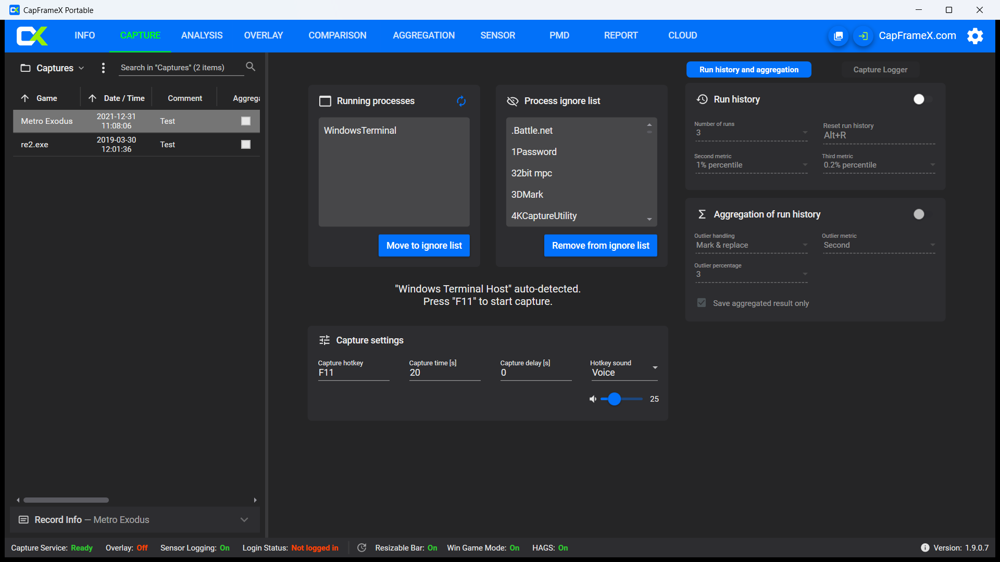
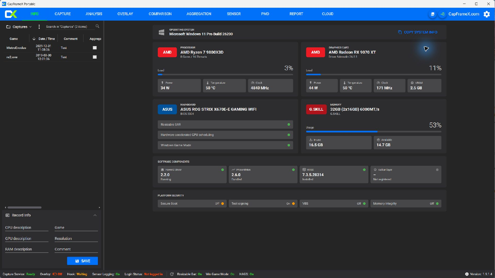
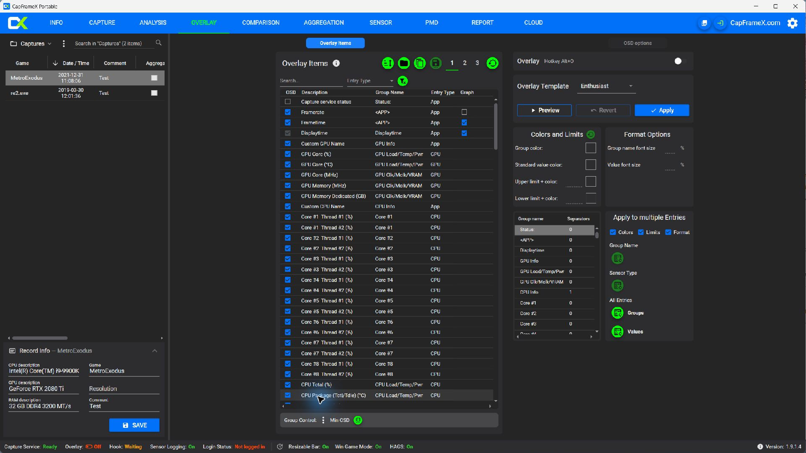
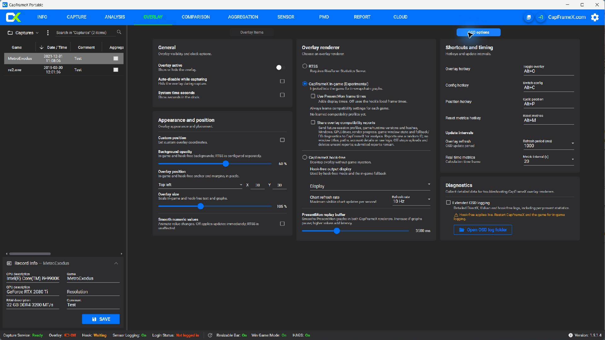
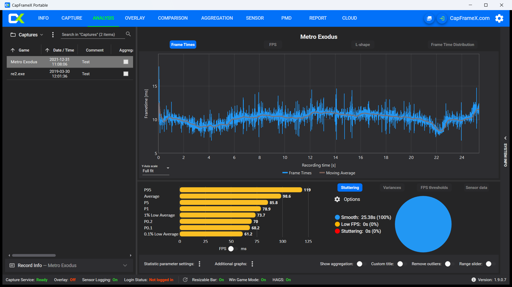
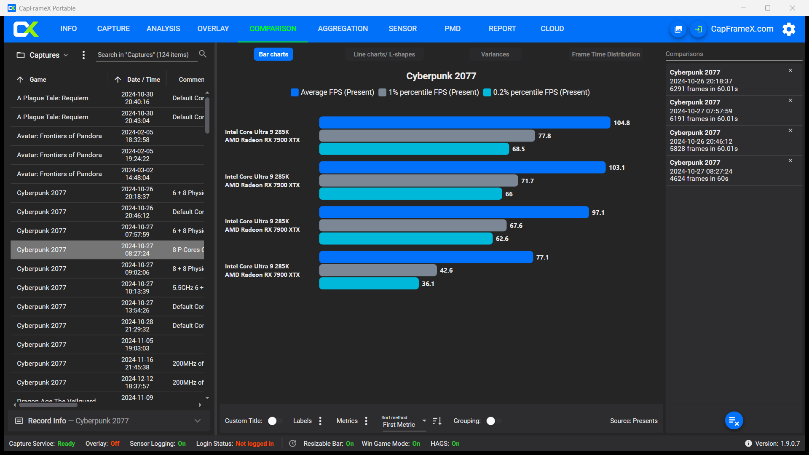
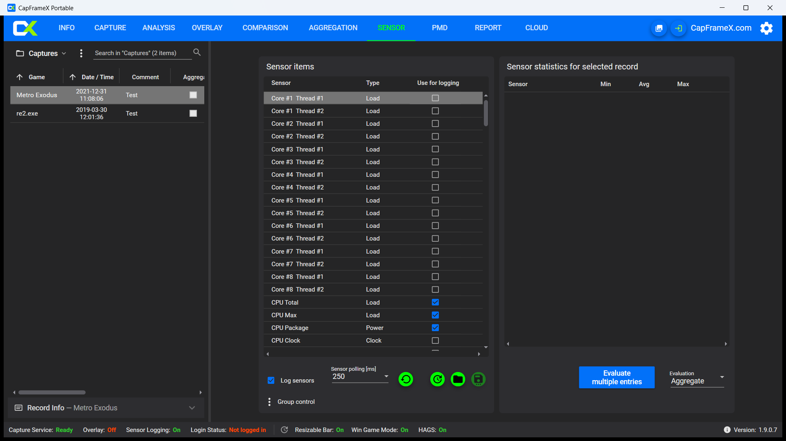
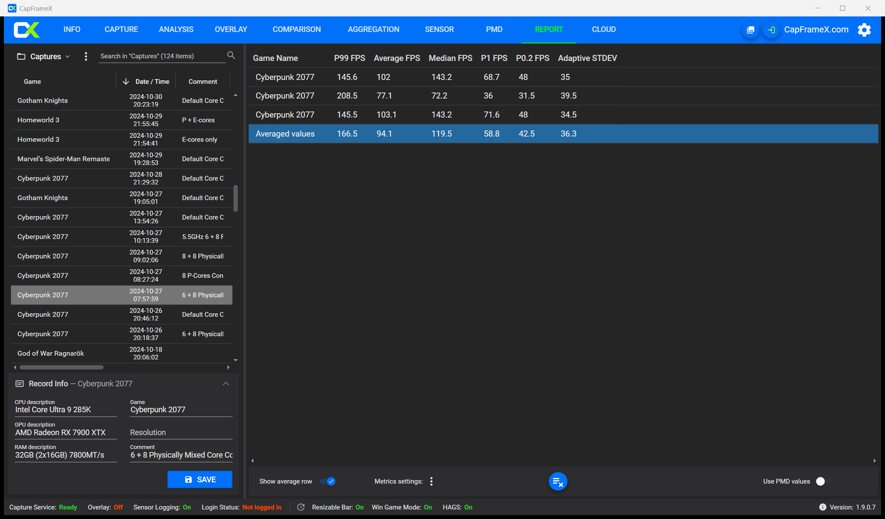
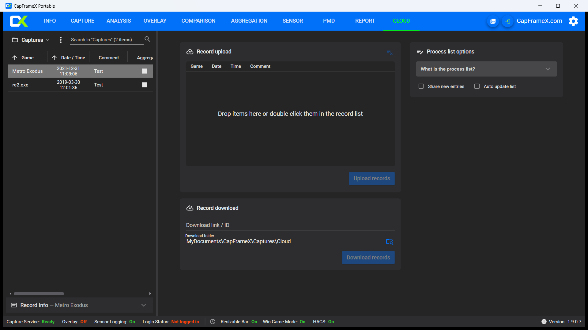

# CapFrameX
Capture, analyze, and compare game performance on Windows. CapFrameX combines Intel's [PresentMon](https://github.com/GameTechDev/PresentMon) with hardware monitoring, frametime and FPS charts, and configurable overlays.

Version **1.9.1** restores the experimental in-game overlay with digitally signed DirectX and Vulkan components for x64 and x86, bundles BENCHLAB Service 2.4.0, and updates PresentMon to 2.6.0. It also expands the Info dashboard, GPU telemetry, and overlay compatibility handling. The application runs on **.NET 10**.

# Remark in our own interest
If you are a reviewer or a youtuber using CapFrameX to get your data, it would be nice to mention us and link to our software.
If you want to use images of the CapFrameX analysis, you could use the built in screenshot function so that our logo and name gets added to the images.

# Sponsorship

<a href="https://hone.gg">
  
</a>

CapFrameX is sponsored by [Hone](https://hone.gg). We thank Hone for supporting the project and its continued development.

# Release

Download **[CapFrameX v1.9.1](https://github.com/CXWorld/CapFrameX/releases/tag/v1.9.1)**:

The packages contain stable application build **1.9.1.5**. This revision adds missing Authenticode signatures to managed dependencies, including LiveCharts.Wpf, and verifies every packaged Windows binary. CapFrameX binaries, native overlay components, the bundled BENCHLAB executable, and setup are digitally signed with the CapFrameX publisher's Certum certificate. Compatible separately installed BENCHLAB services remain supported.

For a portable update, extract the package into a **new folder**, then copy your `Portable` data folder and customized `portable.json` if needed.

| Package | Use |
| --- | --- |
| [Installer](https://github.com/CXWorld/CapFrameX/releases/download/v1.9.1/release_1.9.1_installer.zip) | Extract the ZIP and run `CapFrameXBootstrapper.exe`. Setup installs the application and registers each Vulkan layer in its matching 64-bit or 32-bit HKLM registry view. |
| [Portable](https://github.com/CXWorld/CapFrameX/releases/download/v1.9.1/release_1.9.1_portable.zip) | Extract the complete ZIP and run `CapFrameX.exe`. Keep `portable.json` beside it to store settings, captures, and logs in the portable folder. Vulkan integration requires separate layer registration. |

Install the **[.NET 10 Desktop Runtime (x64)](https://dotnet.microsoft.com/download/dotnet/10.0)** before running setup or the portable application. The Desktop Runtime is required even if another .NET version or the plain .NET Runtime is already installed.

See the [release notes](https://github.com/CXWorld/CapFrameX/releases/tag/v1.9.1) for changes and package checksums, [Portable Mode](PORTABLE_MODE.md) for configuration, and [all releases](https://github.com/CXWorld/CapFrameX/releases) for older versions. Development builds are available from the [build archive](https://archive.capframex.com/).

# Troubleshooting & Known Issues
The following tips address the most common issues reported by users and can help resolve stability, overlay, and capture-related problems efficiently. We recommend working through them in order if you encounter unexpected behavior.

1. **Ensure you are running the latest version**  
   Install the latest [stable release](https://github.com/CXWorld/CapFrameX/releases/latest) and its required .NET Desktop Runtime. Version 1.9.1 requires **.NET 10 Desktop Runtime (x64)**; the installer checks for it before proceeding.

2. **Reset application settings**  
   In some cases, corrupted or outdated configuration files may cause problems. Close CapFrameX, back up your configuration, and rename
   `%appdata%/CapFrameX/Configuration/AppSettings.json`  
   to let CapFrameX recreate its default settings on the next start. In portable mode, use the configuration folder specified in `portable.json` instead.

3. **Reset overlay configuration files**  
   If overlay-related problems persist, close CapFrameX and back up or rename the overlay configuration files located at
   `%appdata%/CapFrameX/Configuration/OverlayEntryConfiguration_(0/1/2).json`.  
   These files will be recreated automatically on the next application start.

4. **Restore missing or zero-value overlay entries**  
   When overlay entries are missing or display constant zero values, open the **Overlay** tab and use the **Reset** button to restore all overlay entries to a valid default state.

5. **Fix incorrect overlay entry order**  
   If the order of overlay entries appears inconsistent or unintentionally rearranged, use the **Sort** button in the **Overlay** tab to restore a clean and logical ordering.

6. **Resolve frametime anomalies after updates**  
   Close CapFrameX and any other capture tools before updating. If a capture service remains running after an application has exited, close its leftover **PresentMon** process before starting a new capture session.

7. **Avoid conflicts with other monitoring tools**  
   Applications such as **HWiNFO** or **AIDA64** that implement their own FPS or frametime metrics may conflict with CapFrameX’s capture service, as they also rely on PresentMon-based mechanisms. Disabling overlapping FPS or frametime monitoring features in those tools is strongly recommended when using CapFrameX.

8. **Fix a missing in-game overlay or crashes with it**  
   If the **CapFrameX in-game** overlay does not appear in a game, the hook-free fallback takes over, or the game crashes only with the in-game renderer, use the hook-free or RTSS renderer for that game. With 1.9.2.1 Beta or later, collect the logs as described in [Collecting the logs](#collecting-the-logs) and create a profile as described in [In-game compatibility profiles](#in-game-compatibility-profiles).

# Capture frametimes

Configure the capture hotkey, duration, sensor logging, and run history. The process list determines which application is captured.



# System information

The Info tab brings together CPU, GPU, memory, and mainboard details with live telemetry, software component versions, and platform security status. Copy the system information directly from the dashboard.



# Overlay

Choose a renderer under **Overlay → OSD options**.

| Renderer | Behavior |
| --- | --- |
| **CapFrameX hook-free** | Built-in overlay without injecting into the game. This is the default for new configurations and offers an output-display picker and chart refresh control. |
| **CapFrameX in-game (Experimental)** | DirectX and Vulkan integration with signed x64/x86 components, game compatibility profiles, and hook-free fallback routing. |
| **RTSS** | Uses [RivaTuner Statistics Server](https://www.guru3d.com/content-page/rivatuner.html), which must be installed separately. |

Configure individual entries, colors, groups, and three profiles in **Overlay items**. OSD options include opacity, zoom, placement, a position hotkey, and PresentMon replay buffering. Existing renderer selections are preserved. If v1.9.0 migrated your in-game selection to hook-free, you can select in-game again in 1.9.1.

### Custom in-game compatibility profiles

The in-game renderer probes every game automatically and remembers the route that works. Since 1.9.2.1 Beta, you can add your own profiles to `%APPDATA%\CapFrameX\Configuration\HookCompatibilityProfiles.xml` for games where it still fails or where the game crashes, without rebuilding CapFrameX. [In-game compatibility profiles](#in-game-compatibility-profiles) describes the file, every setting, and how to derive a profile from the logs, also with the help of an AI assistant.




# Analysis

Inspect frametimes, FPS, percentiles, stuttering, distributions, and recorded sensor data for an individual capture.



# Aggregation

Combine multiple runs using their raw frametimes, with configurable outlier handling. Aggregation is available for recorded captures and directly from the capture run history.

# Comparison

Compare captures using bar charts, time series, distributions, and variance views. Select metrics and labels, sort results, and highlight individual series.



# Sensor

Choose which available CPU, GPU, memory, and storage sensors to record. Version 1.9.0 adds GPU memory allocation telemetry, NVIDIA memory temperature and estimated bandwidth readings, and AMD Anti-Lag integration on supported hardware.



# Report

Collect selected captures in a table, choose the reported metrics, and display an average row. Copy the results from the context menu to use them in Excel or other tools.



# Cloud

Share captures through upload IDs and download shared records for local analysis.



# MCP Server (AI integration)

CapFrameX ships an in-process MCP server that lets compatible AI clients read recorded captures, compute statistics, diagnose issues, and query the live system. It also exposes tools to start and stop captures and update application, overlay, and sensor settings. The server runs only while CapFrameX is running and is reachable on `http://localhost:<WebservicePort>/mcp` (default port `1337`; if taken, CapFrameX falls back to a free port and persists the choice in `AppSettings.json`).

No additional install. The MCP server is part of `CapFrameX.exe`.

## Setup with Claude Code

1. Make sure CapFrameX is running.
2. Look up the active port in `%appdata%/CapFrameX/Logs/CapFrameX.log` (search for the line `MCP endpoint available at http://localhost:<port>/mcp`) or open `%appdata%/CapFrameX/Configuration/AppSettings.json` and read `WebservicePort`.
3. Register the server with Claude Code (one-time):

   ```bash
   claude mcp add -s user capframex --transport http http://localhost:<port>/mcp
   ```

4. Verify:

   ```bash
   claude mcp list
   ```

   Expected:

   ```
   capframex: http://localhost:<port>/mcp (HTTP) - ✓ Connected
   ```

5. In any new Claude Code session, type `/mcp` to see the server in the active connection list. The tools become available to the model.

If CapFrameX is not running, the connection appears as **disconnected**. Start CapFrameX and the connection comes back live.

## Setup with Claude Desktop

Add this to your `claude_desktop_config.json` (Settings → Developer → Edit Config):

```json
{
  "mcpServers": {
    "capframex": {
      "url": "http://localhost:<port>/mcp"
    }
  }
}
```

Restart Claude Desktop. The CapFrameX tools appear in the MCP picker.

## Available tools

| Tool | Purpose |
| --- | --- |
| `cfx_ping` | Connectivity check (returns `pong`). |
| `cfx_list_records` | Lists capture records from the configured directory; optional substring filter on game/process. |
| `cfx_get_record` | Full metadata of a record (system info, run count, settings). |
| `cfx_search_records` | Free-text search across game/comment/CPU/GPU/OS/RAM. |
| `cfx_get_metrics` | FPS metrics (Average, P1, P0.2, Min, Max, AdaptiveStd, …) — single run or all runs. |
| `cfx_compare_records` | Side-by-side metric table across multiple records with absolute and percentage deltas. |
| `cfx_get_sensor_summary` | Per-sensor avg/min/max for CPU/GPU/RAM/VRAM channels. |
| `cfx_analyze_bottleneck` | Classifies a run as cpu-bound, gpu-bound, balanced, thermal-throttling, or power-limited (with confidence + reasoning). |
| `cfx_diagnose_capture` | Scans recent log entries for capture-related failures. Pattern library: ETW conflicts, anti-cheat, permissions, PresentMon errors, blacklisted processes, etc. |
| `cfx_diagnose_general` | Same as above but with focus area (`capture` / `sensors` / `overlay` / `all`). |
| `cfx_get_capture_timeline` | Chronological capture-related events from the log (hotkey, PresentMon start/stop, session save, errors). |
| `cfx_get_current_system` | Live system info: CPU, GPU, RAM, OS, motherboard, Resizable BAR (HW + D3D + Vulkan), HAGS, GameMode, PCI BAR sizes. |
| `cfx_get_capture_status` | Read-only capture state: isCapturing, isLocked, current state (Started, Processing, Stopped, …). |

The table above covers analysis and diagnostics. Additional tools include `cfx_list_processes`, `cfx_start_capture`, `cfx_stop_capture`, `cfx_get_config`, `cfx_set_config`, `cfx_get_overlay_entries`, `cfx_set_overlay_entry`, and `cfx_set_logged_sensors`. Capture-control and configuration tools change application state; the MCP interface is not read-only.

## Example interactions

Ask Claude in natural language. Below are three concrete examples that exercise multiple tools.

### 1. "Compare my last three Cyberpunk records"

Claude internally calls `cfx_search_records` with `"Cyberpunk"`, takes the three most recent ids, then calls `cfx_compare_records` with default metrics (Average, P1, P0.2, Min, Max). Output: a tabular comparison with deltas highlighting which run was best/worst.

### 2. "Why is the latest Spider-Man 2 capture only at 80 fps?"

Claude calls `cfx_list_records` filtered by Spider-Man, picks the newest, then calls `cfx_get_metrics` to confirm the average, `cfx_get_sensor_summary` to see CPU/GPU load, and `cfx_analyze_bottleneck` to get a verdict. Typical answer: *"GPU load averaged 74 %, CPU max-thread load 82 % — the run is CPU-bound; this is consistent with Spider-Man 2's known DX12 main-thread bottleneck."*

### 3. "My benchmark didn't get recorded. Why?"

Claude calls `cfx_diagnose_capture` (default 30-min lookback) and `cfx_get_capture_timeline`. Typical findings: an ETW session conflict (FrameView SDK still installed), a blacklisted process, missing administrator rights, or an anti-cheat that blocked PresentMon — each with a concrete suggested fix.

## Configuration

In `%appdata%/CapFrameX/Configuration/AppSettings.json`:

| Key | Default | Effect |
| --- | --- | --- |
| `McpEnabled` | `true` | Toggle the MCP module on/off. When `false`, the rest of the local API still runs. |
| `WebservicePort` | `"1337"` | Shared with the existing local API. The MCP endpoint lives at `/mcp` on that same port. |

To disable MCP: set `McpEnabled` to `false` and restart CapFrameX. Logs related to the MCP server appear in the standard CapFrameX log file (`%appdata%/CapFrameX/Logs/CapFrameX.log`).

# In-game compatibility profiles

> Editable profiles require **CapFrameX 1.9.2.1 Beta** or later ([beta release](https://github.com/CXWorld/CapFrameX/releases/tag/v1.9.2_beta)). Version 1.9.1 uses only the profiles embedded in CapFrameX and does not read profile files.

The **CapFrameX in-game** renderer injects a hook DLL (`cfx_osd_hook.dll`) into DirectX 11 and DirectX 12 games and draws the overlay into the game's own swapchain. Frame-generation and upscaler runtimes (NVIDIA Streamline/DLSS-G, AMD FidelityFX/FSR frame generation, Intel XeSS-FG), proxy DLLs such as OptiScaler, and unusual startup sequences can take presentation away from the hook or collide with it. A compatibility profile tells the hook, for one executable, which presentation route to use and when to inject.

CapFrameX already probes every game automatically. It tries a sequence of routes (*stages*), judges each one from the status the hook reports, and stores the outcome in `HookCompatibilityProfiles.learned.json`. A hand-written profile is needed when:

- the game **crashes, freezes, or loses its D3D device** with the in-game renderer. A crash ends the probe before it can record a verdict, so the next launch starts on the same stage and crashes again;
- the game needs a setting that probing never tries on its own, for example an **injection delay**;
- probing does not settle on a working stage, or you want to start on a known-good route without probing.

This chapter is a reference for writing such a profile from the evidence in the logs. It is written so that you can hand it, together with the logs listed in [Collecting the logs](#collecting-the-logs), to an AI assistant and let it propose the profile.

## What a profile cannot fix

These cases are not routing problems, and no profile changes them. Check `CapFrameX.log` for them first; the messages are listed as the message templates found in the log (see [Reading `CapFrameX.log`](#reading-capframexlog)).

| Message template (`@mt`) | Meaning | What to do |
| --- | --- | --- |
| `HookOverlay: target PID {pid} blocked by target policy ({reason})`, with a `reason` such as `anti-cheat module '…' matched '…'` or `process '…' is on the in-game injection blacklist` | Injection is refused for this game. | Use the **CapFrameX hook-free** or **RTSS** renderer for this game. |
| `HookOverlay: injection into pid {pid} ('{process}') blocked — {reason}`, with a `reason` starting with `the game was already running when the in-game overlay was enabled` | Safety gate when the renderer is switched on while the game already runs with other overlays. | Restart the game. |
| `HookOverlay: target PID {pid} runtime {runtime} -> no DXGI injection` | The game does not present through DXGI (for example OpenGL or Direct3D 9). | Use hook-free or RTSS. |
| `HookOverlay: DXGI injection into pid {pid} ('{process}') suppressed ({reason})` | A Vulkan game. Vulkan is served by the CapFrameX Vulkan layer, not by the hook. | Profiles do not apply. |
| `HookOverlay: injection into {arch} pid {pid} failed — {error}; …` | Windows refused to load the hook DLL. | Check security software that blocks DLL injection. |

A profile cannot switch the hook off for a single game either. If a game crashes in every configuration, select **CapFrameX hook-free** or **RTSS** while playing it and report the game in a [GitHub issue](https://github.com/CXWorld/CapFrameX/issues) with the logs.

## Where profiles are stored

At startup, CapFrameX merges profiles from three sources, in this order:

1. The embedded defaults.
2. `HookCompatibilityProfiles.xml` next to `CapFrameX.exe`. The installer and the portable package ship it with a copy of the embedded defaults, which makes it a good collection of working examples.
3. The **user file** `%APPDATA%\CapFrameX\Configuration\HookCompatibilityProfiles.xml`. In portable mode it is located in the configuration folder set by `paths.config` in `portable.json` (default `Portable\Config`). CapFrameX creates a valid, empty user file (and its folder) at startup if it is missing; an existing file is never overwritten.

A later source replaces the **entire profile** for the same executable. Attributes omitted in the replacing profile take their defaults; nothing is inherited from the replaced profile. Profiles for other executables are unaffected.

Put your profiles into the user file. It can be edited without administrator rights, and an update of CapFrameX can replace the file next to the executable. Keep the user file limited to your own changes so that updated default profiles still take effect for all other games.

Profiles are read only at startup: **restart CapFrameX and the game after every edit.**

## File format

```xml
<?xml version="1.0" encoding="utf-8"?>
<HookCompatibilityProfiles version="1">
  <!-- One Profile element per game executable. -->
  <Profile executable="MyGame-Win64-Shipping.exe"
           enableGenericD3D12PresentRoute="true"
           disableFidelityFxSwapchainLifecycleHooks="true"
           source="2026-10-08, CapFrameX 1.9.2.1: crash when toggling FSR frame generation; cfxhook.log ended with FidelityFX swapchain replacement" />
</HookCompatibilityProfiles>
```

The file is validated strictly. If it cannot be read, is not well-formed XML, or violates any rule below, CapFrameX ignores the **whole file**, keeps the profiles from the other sources, and logs the warning `HookOverlay: ignoring external compatibility profiles at {path}; keeping profiles from the other sources` with the reason in the exception text.

- The root element is `HookCompatibilityProfiles` with `version="1"`.
- Each `Profile` element needs an `executable` attribute and at least one setting from the table below. `source`, the retired attributes, a delay of `0` and an empty module name do not count as a setting.
- The same executable must not appear twice in one file.
- `executable` is the image name of the process that renders the game. Directory and extension are ignored and the comparison is case-insensitive, so `MyGame.exe`, `mygame` and `C:\Games\MyGame.exe` all match the process `MyGame`. Take the name from the `process` value of the log message `HookOverlay: target PID {pid} is '{process}'` and append `.exe`. For games started through a launcher, name the game process, not the launcher (Unreal Engine games often use `<Name>-Win64-Shipping.exe`).
- Boolean values are `true` or `false`. `1`, `yes` or `on` are invalid.
- `injectionDelayMilliseconds` is a whole, non-negative number of milliseconds without a unit.
- `earlyInjectionModule` is a DLL file name ending in `.dll`, without a directory.
- Unknown attributes and elements are ignored **without a warning**. A misspelled attribute name therefore has no effect; copy the names exactly from the table below.
- XML comments are allowed. Escape `&`, `<` and `"` inside attribute values as `&amp;`, `&lt;` and `&quot;`.

An accepted file logs `HookOverlay: loaded {count} external compatibility profiles from {path}` at startup.

## Settings

| Attribute | Value | Default | Effect |
| --- | --- | --- | --- |
| `executable` | Executable name | required | The game process the profile applies to. |
| `enableGenericD3D12PresentRoute` | `true`/`false` | `false` | **D3D12 only.** Draws on the game's native DXGI Present with an observed D3D12 command queue (the RTSS model) instead of inside the Streamline or XeSS-FG presentation proxies. |
| `disableFidelityFxSwapchainLifecycleHooks` | `true`/`false` | `false` | Does not install the FidelityFX (FSR frame generation) swapchain hooks. Use only together with `enableGenericD3D12PresentRoute="true"`. |
| `enableXeFgNativePresentQueueRoute` | `true`/`false` | `false` | XeSS frame generation: draws every eligible native Present on the presenter queue captured from XeSS-FG. Use together with `earlyInjectionModule="d3d12.dll"`. |
| `earlyInjectionModule` | DLL name, usually `d3d12.dll` | none | Injects at process start as soon as this module is loaded, before the game presents its first frame. |
| `injectionDelayMilliseconds` | Milliseconds, for example `15000` | `0` | Waits before injecting the hook. |
| `source` | Free text | none | Documentation only: why the profile exists. CapFrameX ignores it. |

### `enableGenericD3D12PresentRoute`

By default the hook is *vendor-aware*: when Streamline (DLSS-G) or XeSS-FG are loaded, it hooks their presentation proxies and draws there. With this setting the hook uses the *generic D3D12* route that RTSS also uses: it draws on the native DXGI `Present` with an observed DIRECT command queue and lets the Streamline and XeSS-FG proxies pass through untouched. Frame-generation telemetry keeps working. FidelityFX swapchain hooks stay installed unless `disableFidelityFxSwapchainLifecycleHooks` is also set.

Use it when Streamline, DLSS-G or XeSS-FG are loaded and the overlay never appears, stays in `Initializing`, stands down for a frame-generation runtime, or the game crashes in vendor proxy code.

**Never use it for D3D11 games.** On the generic route the hook does not draw on D3D11 swapchains, so the overlay disappears completely. The evidence in the `compatibility plan` log message contains `no d3d12` for such games.

### `disableFidelityFxSwapchainLifecycleHooks`

Does not install the hook's FidelityFX frame-generation creation and destruction hooks (around `ffxCreateContext`, `ffxDestroyContext` and the frame-interpolation swapchain functions). A FidelityFX replacement swapchain then never takes over presentation for the overlay, and the generic route stays in charge while FSR frame generation is switched on or off.

Use it when the game crashes or hangs when FSR frame generation is toggled or the resolution or display mode changes, when `cfxhook.log` ends with FidelityFX messages before a crash, or when the evidence shows several FidelityFX loader copies or a `dxgi.dll` proxy (OptiScaler and similar mods). Always combine it with `enableGenericD3D12PresentRoute="true"`; every automatic stage and every shipped profile does.

### `enableXeFgNativePresentQueueRoute`

For XeSS frame generation (`libxess_fg.dll`). The hook stays vendor-aware but draws on every eligible native Present on the exact presenter queue it captured from XeSS-FG's swapchain creation, independent of the XeSS-FG status. To capture that queue the hook must already be resident when XeSS-FG initializes, so combine this setting with `earlyInjectionModule="d3d12.dll"`. Do not combine it with `enableGenericD3D12PresentRoute`: the generic route replaces the vendor-aware route that this setting extends, and no automatic stage combines the two.

Use it when the verdict is `EarlyInjectionRequired`, or when the hook declines to draw because "the XeSS-FG proxy has no authoritative queue" or "the indeterminate XeSS-FG route produced no draw".

### `earlyInjectionModule`

Normally the hook is injected after PresentMon has reported the game's first frames, when the swapchain already exists. With early injection, CapFrameX watches for the game process to start and injects the hook as soon as the named module is loaded, before the first frame. The hook then observes swapchain and command-queue creation and the initialization of frame-generation runtimes.

- Use `d3d12.dll`. It is loaded before upscalers and frame-generation runtimes. The automatic probing uses `sl.interposer.dll` only for Streamline games without a loaded `d3d12.dll`.
- CapFrameX must already be running with the in-game renderer selected **before the game starts**. If the game is already running, the hook is injected late with the profile's other settings.
- The log confirms it with `HookOverlay: EARLY injected {dll} ({arch}) into pid {pid} ('{process}') after '{module}' was mapped and before runtime detection`, and the `attach` value of the `compatibility plan` message is `Early`.

Use it when the generic route finds no command queue (`NoQueue`), when the hook sees no Present although frame generation is loaded (`NoPresent`), and for XeSS-FG (`EarlyInjectionRequired`). Do not use it to cure a crash during startup: it places the hook in the game even earlier. Use a delay instead.

### `injectionDelayMilliseconds`

Waits before the hook is injected. On the normal path the delay starts at the first injection attempt for the process, which follows PresentMon's first frames; a retry after a failed injection only waits for the rest of the delay. With `earlyInjectionModule` it starts when the module is loaded. The in-game overlay appears only after the delay. On the normal path the log shows `HookOverlay: compatibility stage {stage} delays injection into pid {pid} by {delaySeconds:0.#} s`.

Use it when the game crashes or freezes within seconds after `HookOverlay: injected {dll} ({arch}) into pid {pid}` while it is still starting (launcher, intro videos, shader compilation) and runs normally with the hook-free renderer. `15000` is the injection delay RTSS uses and the value of the shipped Dirt 5 profile; raise it to `30000` or `60000` for long shader compilation. The automatic probing never adds a delay.

### `source`

Free text for people. Record the date, the CapFrameX version, the symptom and the log lines that justify the profile, so that the profile can be reviewed or removed later.

### Retired attributes

Older catalogs used `disableDxgiSwapchainReleaseHook` and `enableDxgiFactorySwapchainLifecycleHooks`. They are still accepted when their value is `true` or `false`, but have no effect, because that behaviour is now built into the hook for every game. Do not use them.

## How profiles and automatic probing interact

The hook understands four routes. Each can additionally use early injection and an injection delay. The automatic probing tries them in this order and names them in the log as follows:

| Order | Stage name in the log | Profile attributes | Flags (`cfxhook.log` / learned file) |
| --- | --- | --- | --- |
| 1 | `vendor-aware` | none (default without a profile) | `0x0` / `0` |
| 2 | `vendor-aware + XeSS-FG native queue` | `enableXeFgNativePresentQueueRoute` | `0x2` / `2` |
| 3 | `generic D3D12` | `enableGenericD3D12PresentRoute` | `0x4` / `4` |
| 4 | `generic D3D12 + no FidelityFX lifecycle hooks` | `enableGenericD3D12PresentRoute` + `disableFidelityFxSwapchainLifecycleHooks` | `0xC` / `12` |
| 5–8 | the same, followed by `+ early injection (d3d12.dll)` | the same + `earlyInjectionModule` | the same |

A delay adds `+ <n> s delay` to the name. In `CapFrameX.log` the `flags` value names the same bits: `None`, `EnableXeFgNativePresentQueueRoute`, `EnableGenericD3D12PresentRoute`, `DisableFidelityFxSwapchainLifecycleHooks`. Without a profile, only the stages the evidence supports are tried: stage 2 only for XeSS-FG with early injection, the generic stages only when `d3d12.dll` is loaded, stage 4 only with FidelityFX evidence, and the early-injection stages only when a frame-generation runtime is loaded.

With a profile:

- The profile is always the first stage, with exactly its flags, module and delay. The log marks it `[catalog]`.
- Probing continues only with the stages listed after the profile's stage; earlier stages are dropped. A profile with early injection therefore leaves only early-injection stages. Delays do not affect the order.
- Learned results can move the start to a later stage of that list, but never before the profile. To test a changed profile from its first stage, close CapFrameX and delete the game's entries from `HookCompatibilityProfiles.learned.json` (or the whole file) in the configuration folder.
- Probing can switch on the generic route and the FidelityFX setting, and switch the XeSS-FG queue route, inside the running game (`HookOverlay: escalating pid {pid} ('{process}') live to compatibility stage …`). Early injection, a delay, or leaving the generic route or the FidelityFX setting need a fresh game process: the overlay status shows **Restart game**, the hook-free fallback covers the rest of the session, and the next launch starts on the new stage. For early injection, the log asks you to keep CapFrameX running and restart the game.

A stage is judged by the hook's status. Paused, minimized or idle periods do not count.

| Verdict | Rule |
| --- | --- |
| `Success` | The overlay rendered for 2 s. |
| `InstallHung` | The hook did not finish installing within 6 s. |
| `NoQueue` | Generic route: no compatible D3D12 command queue within 5 s. |
| `NoPresent` | No DXGI Present within 15 s after the hook was armed. |
| `RendererStalled` | The renderer stayed in `Initializing` for 10 s, or the 20 s stage budget ran out. |
| `ForeignPresenter` | A frame-generation runtime presents the game and the hook stands down. |
| `EarlyInjectionRequired` | XeSS-FG was initialized before the hook captured its queue. |
| `InstallFailed`, `OsdCreateFailed` | Hook installation or renderer creation failed. |
| `StatusTimeout` | The hook published no status for 3 s. |
| `QueueRebinding` | A replacement swapchain is being bound; transient, no action needed. |

## Collecting the logs

1. In the **Overlay** tab, enable **Extended OSD logging** under **Diagnostics**.
2. Select the **CapFrameX in-game** renderer and switch the overlay on.
3. Restart CapFrameX, then start the game. The hook reads the logging switch only when it is loaded into the game.
4. Reproduce the problem: stay in the game for at least 30 s, and toggle frame generation, upscaling or the display mode if the problem is related to them. Then exit the game, or let it crash.
5. Collect these files:
   - `%APPDATA%\CapFrameX\Logs\CapFrameX.log`, including rotated files such as `CapFrameX_001.log` (portable mode: `Portable\Logs`);
   - `%TEMP%\cfx-osd-logs\cfxhook.log`, written by the hook inside the game. **Open OSD log folder** in the Overlay tab opens this folder. `cfx_osd.log` and `cfx_present_stats.log` in the same folder are not needed for profiles;
   - `HookCompatibilityProfiles.learned.json` and your `HookCompatibilityProfiles.xml` from the configuration folder;
   - after a crash, the **Application Error** event (ID 1000) for the game from Windows Event Viewer (**Windows Logs → Application**), with the faulting module and exception code;
   - a short description: game version, DirectX version, upscaler and frame-generation settings, other overlays in use (Steam, Discord, RTSS, OBS, ShadowPlay), and when exactly the problem occurs.
6. Disable **Extended OSD logging** again; the detailed logs grow quickly.

### Reading `CapFrameX.log`

Each line is a JSON object (Serilog compact format). `@t` is the UTC timestamp, `@mt` the message template with `{name}` placeholders, and each placeholder value is a separate property of the same object. `@l` is the level and is absent for information messages; `@x` holds exception text. For example:

```json
{"@t":"2026-10-08T18:04:11.5120000Z","@mt":"HookOverlay: compatibility plan for pid {pid} ('{process}', {attach} attach) — evidence [{evidence}], signature {signature}; stage {index}/{count} {stage}; {reason}","pid":15872,"process":"MyGame","attach":"Late","evidence":"Streamline, DLSS-G, d3d12","signature":"sl+sldlssg","index":2,"count":4,"stage":"generic D3D12 [evidence]","reason":"a frame-generation runtime is resident and the swapchain already exists; starting on the generic D3D12 route"}
```

The relevant messages start with `HookOverlay:`. Follow them per process ID in chronological order:

| `@mt` starts with | Tells you |
| --- | --- |
| `HookOverlay: loaded {count} external compatibility profiles from {path}` | A profile file was accepted. |
| `HookOverlay: ignoring external compatibility profiles at {path}` | A profile file was rejected; the reason is in `@x`. |
| `HookOverlay: target PID {pid} is '{process}'` | The executable name for `executable`. |
| `HookOverlay: compatibility plan for pid {pid} …` | Attach mode, evidence, signature, starting stage with its origin (`[catalog]` = profile, `[learned]`, `[evidence]`) and the reason. |
| `HookOverlay: compatibility stage {index}/{count} {stage} [{source}] published flags {flags} …` | The flags handed to the hook. |
| `HookOverlay: injected {dll} ({arch}) into pid {pid}` / `HookOverlay: EARLY injected …` | The injection time. Compare it with the time of a crash. |
| `HookOverlay: compatibility stage … ended with {verdict}: {detail}` | The verdict and its explanation, including the install phase or the reason the hook declined to draw. |
| `HookOverlay: escalating pid … live to compatibility stage …` | A route was switched inside the running game. |
| `HookOverlay: learned profile for '{process}' ({signature}) is now stage {stage}, verified {verified}, exhausted {exhausted}, pending {pending}` | What was stored for the next launch. |
| `HookOverlay: in-game renderer unusable for pid … ({reason}); enabling hook-free fallback` | Why the hook-free overlay took over. |
| `HookOverlay: compatibility evidence for pid … changed from … to … while the in-game overlay was standing down — re-probing …` | Frame generation was switched inside the game and probing started again. |

Evidence entries and signature tokens:

| Evidence | Signature token | Detected module |
| --- | --- | --- |
| `Streamline` | `sl` | `sl.interposer.dll` |
| `DLSS-G` | `sldlssg` | `sl.dlss_g.dll`, `nvngx_dlssg.dll` |
| `dlssg-to-fsr3` | `dlssg2fsr3` | `dlssg_to_fsr3*.dll` |
| `XeSS-FG` | `xefg` | `libxess_fg.dll` |
| `FSR-FG` | `ffxfg` | `amd_fidelityfx_dx12.dll`, `amd_fidelityfx_framegeneration_dx12.dll`, `ffx_backend_dx12_*.dll` |
| `<n> FidelityFX loader copies` | `ffxloader2` | `amd_fidelityfx_loader_dx12.dll` or `amd_fidelityfx_dx12.dll` loaded from two or more folders |
| `dxgi.dll proxy at '<path>'` | `dxgiproxy` | a `dxgi.dll` outside `System32`/`SysWOW64`, for example OptiScaler |
| `d3d12` / `no d3d12` | – | whether `d3d12.dll` is loaded |

The signature `none` means no relevant module was found, `unknown` that the module list could not be read.

### Reading `cfxhook.log`

The hook writes this file from inside the game process, so it also covers the moments before a crash. Each injection is marked by `hook DLL loaded (pid=…, arch=…)`. After a crash, the last lines before the log ends are the most important. The wording can change between hook builds; match on the key phrases:

| Line contains | Meaning |
| --- | --- |
| `compatibility channel V2 flags=0x… loaded for pid=…` | The flags the hook received. `0x2` XeSS-FG queue route, `0x4` generic route, `0x8` no FidelityFX lifecycle hooks; combined as a sum, for example `0xC`. Use it to confirm that a profile reached the hook. |
| `compatibility profile: none` | No flags; the hook runs vendor-aware. |
| `compatibility flags applied live` / `pending restart` | A live route switch; bits pending a restart apply on the next game launch. |
| `RTSS-compatible D3D12 profile active` | The generic route is in effect. |
| `InstallHooks returned … -> DXGI Present hook NOT armed` | The hook could not install. A profile does not help; report it. |
| `… hooks ARMED …` for Streamline, XeSS-FG or FidelityFX | Which vendor hooks were installed. The last vendor named before a crash is the prime suspect. |
| `FidelityFX export arming faulted` | The FidelityFX hooks could not be installed safely. |
| `FidelityFX … is replacing the swapchain`, `FidelityFX swapchain context … destroyed`, `FidelityFX replacement swapchain now owns presentation` | FSR frame-generation transitions. |
| `Streamline proxy present had no authoritative creation queue`, `Streamline draw skipped: no authoritative creation queue` | The Streamline proxy cannot be drawn on. |
| `frame-generation runtime is presenting -> in-game overlay stands down` | A frame-generation runtime presents instead of the game. |
| `draw skipped: no compatible observed queue`, `presentation queue is unproven; observed fallback blocked` | The generic route found no usable command queue. |
| `XeSS-FG InitFromSwapChainDesc exposed no factory-created native swapchain`, `XeSS-FG GetSwapChainPtr live binding unavailable` | The XeSS-FG queue was not captured. |
| `native D3D12 compositor initialized`, `first overlay draw begins` | The renderer works on this route. |

## Choosing the settings

Start from the symptom, take the first matching row, and change only one thing per test run.

**The game crashes or freezes with the in-game renderer** (and runs with the hook-free renderer):

| Evidence | Profile to try first | If the problem persists |
| --- | --- | --- |
| Crash or freeze within seconds after `HookOverlay: injected …` while the game is still starting; `cfxhook.log` has no `first overlay draw` | `injectionDelayMilliseconds="15000"` | Raise to `30000`–`60000`, then add the routing setting of the next rows that matches the evidence. |
| Crash or device loss when FSR frame generation is toggled or the resolution or display mode changes; `cfxhook.log` ends with FidelityFX lines; or evidence `FSR-FG`, `FidelityFX loader copies` or `dxgi.dll proxy` | `enableGenericD3D12PresentRoute="true"` + `disableFidelityFxSwapchainLifecycleHooks="true"` | Add `injectionDelayMilliseconds="15000"`. |
| Crash with Streamline or DLSS-G loaded, for example when DLSS frame generation is toggled; `cfxhook.log` ends with Streamline lines | `enableGenericD3D12PresentRoute="true"` | Add `disableFidelityFxSwapchainLifecycleHooks="true"`. |
| Crash only on a stage with early injection (`attach` is `Early` in the plan message) | The same flags without `earlyInjectionModule` | Add `injectionDelayMilliseconds`. |
| The faulting module in the Application Error event is unrelated to the overlay, or the game also crashes with the hook-free renderer | No profile; the crash is not caused by the hook. | – |

The routing settings require D3D12. For a D3D11 game (`no d3d12` in the evidence), only `injectionDelayMilliseconds` applies.

**The overlay does not appear, flickers, or the hook-free fallback takes over:**

| Verdict or log evidence | Profile |
| --- | --- |
| `ForeignPresenter`, or `RendererStalled` with "Streamline owns the D3D12 presentation contract" or "the Streamline proxy exposed no creation queue" | `enableGenericD3D12PresentRoute="true"` |
| `ForeignPresenter` or `RendererStalled` with "a FidelityFX replacement swapchain owns presentation", or with FidelityFX evidence | `enableGenericD3D12PresentRoute="true"` + `disableFidelityFxSwapchainLifecycleHooks="true"` |
| `InstallHung` in phase `FidelityFxExports` | `enableGenericD3D12PresentRoute="true"` + `disableFidelityFxSwapchainLifecycleHooks="true"` |
| `InstallHung` in phase `StreamlineProxy` or `XeFgProxy`, or `InstallFailed` | `enableGenericD3D12PresentRoute="true"` |
| `NoQueue` on a generic stage | The same generic settings + `earlyInjectionModule="d3d12.dll"` |
| `EarlyInjectionRequired` | `enableXeFgNativePresentQueueRoute="true"` + `earlyInjectionModule="d3d12.dll"` |
| `NoPresent` with frame-generation evidence | The current stage's settings + `earlyInjectionModule="d3d12.dll"` |
| `NoPresent` without frame-generation evidence | No profile. Check that the captured process is the one that renders. |
| `OsdCreateFailed`, `StatusTimeout` | No profile; report the logs. |
| Probing reaches `Success` but starts over or falls back on every launch | Copy the verified stage from `HookCompatibilityProfiles.learned.json` into a profile (see below). |

A verified entry in `HookCompatibilityProfiles.learned.json` (`"verified": true`) translates directly into a profile: `flags` `4` means `enableGenericD3D12PresentRoute="true"`, `12` adds `disableFidelityFxSwapchainLifecycleHooks="true"`, `2` means `enableXeFgNativePresentQueueRoute="true"`, and non-empty `earlyInjectionModule` and `injectionDelayMs` values map to `earlyInjectionModule` and `injectionDelayMilliseconds`. An entry with `flags` `0` and no module or delay is the default and needs no profile.

## Testing a profile

1. Close CapFrameX. Add or change the profile in the user file and remove the game's entries from `HookCompatibilityProfiles.learned.json`.
2. Start CapFrameX and check `CapFrameX.log` for `HookOverlay: loaded {count} external compatibility profiles from {path}` with the user file as `path`. If the file was ignored instead, fix the reason given in `@x`.
3. Start the game. In the `compatibility plan` message, `index` must be `1`, `stage` must name your stage followed by `[catalog]`, and `reason` must read `catalog profile … is stage 1/…`. `cfxhook.log` must show the expected flags.
4. Success is a `… ended with {verdict}: {detail}` message with `verdict` `Success`, followed by `learned profile for '{process}' …` with `verified` `true`. Check the overlay in the game, including the situation that failed before (for example toggling frame generation).
5. If it still fails, collect the new logs and take the next row of the tables above.

Example profiles from the shipped catalog:

```xml
<!-- Crash at startup: RTSS-style injection delay. -->
<Profile executable="dirt5.exe" injectionDelayMilliseconds="15000" />
<!-- Streamline without a usable creation queue: generic route. -->
<Profile executable="witcher3.exe" enableGenericD3D12PresentRoute="true" />
<!-- Generic route that needs to see queue creation: early injection. -->
<Profile executable="JediSurvivor.exe" enableGenericD3D12PresentRoute="true" earlyInjectionModule="d3d12.dll" />
<!-- Frame generation and FidelityFX: generic route without FidelityFX lifecycle hooks. -->
<Profile executable="Stalker2-Win64-Shipping.exe" enableGenericD3D12PresentRoute="true" disableFidelityFxSwapchainLifecycleHooks="true" />
```

## Instructions for AI assistants

When you create a profile from this chapter and the user's logs:

1. Rule out the cases in [What a profile cannot fix](#what-a-profile-cannot-fix). If one applies, explain it instead of writing a profile.
2. Take the executable name from the `process` value of `HookOverlay: target PID {pid} is '{process}'`, append `.exe`, and make sure it is the game process, not a launcher.
3. Reconstruct each attempt per process ID: the `compatibility plan`, the published flags, the injection time, the verdict, the learned result, and the last `cfxhook.log` lines. For a crash, compare the time of the injection with the time of the crash.
4. Choose the settings from [Choosing the settings](#choosing-the-settings). Prefer the smallest change that explains the evidence, and change one thing compared with the previous attempt.
5. Respect the constraints: no `enableGenericD3D12PresentRoute` when the evidence says `no d3d12` or the game uses D3D11; `disableFidelityFxSwapchainLifecycleHooks` only together with `enableGenericD3D12PresentRoute`; `enableXeFgNativePresentQueueRoute` only together with `earlyInjectionModule="d3d12.dll"` and never with the generic route; no early injection against startup crashes.
6. Return the complete user file (`%APPDATA%\CapFrameX\Configuration\HookCompatibilityProfiles.xml`), keep the user's other profiles, write a `source` attribute with the date, the symptom and the deciding log lines, and check the file against the rules in [File format](#file-format).
7. Tell the user how to test it: close CapFrameX, remove the game's learned entries, restart CapFrameX and the game, and which log messages confirm success. If the information is not sufficient, name the missing log or observation instead of guessing.

# Instruction manual
Learn how to use CapFrameX.

## Record list
This list is always located at the left section, regardless of the view you're currently in.

It constantly observes the output directory so every capture will show up here as soon as the capture has finished.
This also includes every OCAT or PresentMon capture you put into that directory.

Changing directories:  
Click the folder breadcrumb above the record list to open the folder popup. Select the root capture folder or browse its subfolders without resizing the record list.
Use the tree view's context menu to create or delete subfolders or open a folder in Explorer. You can also move record files through the context menu in the record list itself.

Changing record info:  
At the bottom of the record list you can see and change the CPU, GPU and RAM description and add a custom comment to every capture.
Also you can edit the game name, since the process name is used as default. 
This gets saved in a process list file that is being compared with a list we update on every new version of CapFrameX to add new games that aren't already on your list. 

## Global Navigation Bar
Located at the top  
Contains all the different views, a screenshot button, a login button (for additional cloud services), a direct link to the CX website and an options menu. 
The screenshot button takes a screenshot of the current view excluding the record list.

## Settings (Options)

* Graph filter window size = The time period in which the filtered FPS graphs are being averaged (Analysis & Comparison View)
* FPS values decimals = The number of decimals for the FPS values
* Screenshot directory = The directory in which your screenshots are saved. 
* Use "MsBetweenDisplayChange" metrics. Uses display times for metric calculation. Enable this option when analyzing displayed frames with Frame Generation.
* Use PC Latency. Still beta state. Disable if you encounter frame time issues. Restart CapFameX after changing the option.
* Capture file mode = How capture files are saved  
  JSON: Standard JSON file  
  JSON + CSV: Additional CSV file that won't be used by CX but can be opened to get a better view on the raw PresentMon data  

## Settings (Hardware)

* Primary Graphics Adapter. Select the primary graphics adapter for sensor and overlay management. Auto (default) removes iGPU when it least one dGPU is detected.
* Hardware info source = What will be written into the capture file as your CPU, GPU and RAM config.  
  Automatic detection: What's delivered by the system  
  Custom description: What you write into the text boxes below
* Use "TBP Sim" sensor values (AMD graphics cards) if available

## Settings (App)

* Start with windows & Start minimized = Autostart option and starting in tray
* "Dark Mode" UI color mode
* Receive notifications to get important information about the software and the project

## Capture view
Here you can set your capture hotkey, the capture time (0=unlimited), choose if and how precisely you want to log sensor data (like CPU/GPU load and power) and set the hotkey response sounds.  
An info text always informs you what's going on with the capture service and also tells you what to do in certain situations.
For more detailed information about the capture events, you can take a look at the capture logger on the right side.

Run history and aggregation options  
Run history to set a number of runs for which you get a simple analysis directly in the OSD. If the history is full, any additional run will replace the oldest one.   

Aggregation to combine the runs in the history to a single record file once the history is full, while marking outliers within the history.  
This doesn't take the calculated performance parameters of each record file and calculates an average out of them. It takes the raw frametimes of each record file and puts them into a new file, calculating every parameter based on that set of frametimes.  
Aggregation outlier handling: A full history is checked for outliers using the median of a selectable metric and an also selectable percentage value.

"Mark & use": Outliers are marked, but all runs will be used for the aggregation.
	
"Mark & replace": If outliers exist, you have to do additional runs to replace them. Aggregation triggers when you have a full history without outliers.  
	
"Save ggregated results only" to only keep the final aggregated file on your drive. If unchecked, every single capture will be saved alongside the aggregated one.


## How to make a capture
The process you want to capture has to be present in the "Running processes" list. This list automatically lists all running processes from which frametimes can be captured.

For the easiest way of just getting into a game and pressing the hotkey to start a capture, this list may only contain one single process, otherwise the service won't know which process you want captured.
If you have more than one process detected, you can still select the one you want and capturing will work just fine.
However you wouldn't want to tab out of your game to do this. This is where our ignore list comes into play.

With the buttons below the two lists you can add or remove any process from the ignore list, the ideal scenario is a completely empty running processes list at the start of CapFrameX.
With this, you can just start your game and since it'll be the only process in the list, just push the hotkey.  
In case a process wasn't detected correctly you can try to rescan processes with the button at the top of the running processes list.

The ignore list entries are drawn from the same process list that contains your game names, which gets updated with our own list on every new Version of CapFrameX.


## Overlay view
Contains the settings for the items displayed in the OSD as well as the settings for a run history and the aggregation function.  

Left side  
Overlay items list where you can set the items you want to see in the OSD and change their order by drag and drop. Items with the same group name will be displayed within a single line.
Three profiles to save different overlay configurations.
The overlay hotkey shows or hides CapFrameX's OSD. With the RTSS renderer, it controls CapFrameX's entries without hiding entries provided by other applications.

Right side  
Overlay items options  
Here you can set colors, limits and font sizes for each individual overlay entry. The currently selected entry is always displayed at the top.  
If you want to apply one or more of these settings to multiple entries, e.g. red color above a limit of 95 for all CPU thread loads, you can set them for one entry and then click on the "Sensor type" button at the bottom right side.
This will apply the settings for all entries that are CPU loads. The same is possible for entries with the same group name, e.g. if you want a certain group color for all entries with group name X.
The group name or sensor type for which settings are applied is always displayed next to the buttons.  
At the bottom left side you can set separators for all currently used group names, setting one separator for a group results in an empty line above that group.

## Analysis view
This is where you can analyse the captures you made one by one.

At the tops you can choose between frametime graphs, FPS graphs and L-shapes.  
For the frametime graphs you can set a y-axis scale so that you are always looking at the same ms range for each record.  
For the FPS graphs you can choose a filter mode so that you can either see the raw FPS data or a time based average filter to see a more clear FPS trendline.
Below that you have your performance parameters like min, max, avg and percentiles on the left.  
On the right you have three tabs, the first one is a pie chart which shows the amount of time you had stuttering (frametimes above 2.5x average (default)) or low FPS (frametimes above converted 25FPS (default)), the second one is a diagram where you can see how many frames were below or above specific FPS thresholds.
If you chose to log sensor data for a record, two additional options are enabled: You can see the min, avg and max values of some basic sensors over the course of the benchmark as well as adding additional graphs to show you CPU and GPU load directly in the frametime chart.  
At the bottom is a toolbar where you can change the performance parameters, toggle the additional sensor data graphs, remove unusual outliers from the graphs and activate a range slider that you can also use to cut a record and saving it as a new file.
On the very right side of the page, there is a "System info" expander which shows all the HW and SW information available for the selected benchmark.

## Aggregation view
Here you can manually aggregate records that were already saved.
Add them to the list and set the metrics you want to be displayed as well as the outlier handling options.
Outliers will be marked red and you can choose to include or exclude them for the aggregation. On aggregation you'll see a simple result line and a new record file is created containing all the frametime data of the aggregated records.

## Comparison View
Here you can compare multiple records.  
With a double-click from the record list you can add the captures to the comparison list and with a click on the comparison list entry you can select them in the record list. With the button at the end you can remove them all from the list.

The first tab shows you the records as bar charts.  
If you compare records from just a single game, this game is set as a title above the diagram. If you compare records from multiple games, the names are labeled on the bars.
In addition you have two adjustable contexts that are set as labels for each record.
At the bottom is a toolbar where you can change the sorting and adjust the displayed metrics as well as the contexts.  
For screenshot purposes you can activate "Custom title" to type in a title at the top yourself.
The "Grouping" toggle switches between two sorting modes:  
off-> all records are sorted by FPS  
on-> records are sorted by game, then by FPS  

The second tab shows you the frametime + FPS graphs and L-shapes.  
You can highlight the graphs with a mouseover in the comparison list and also change their color or hide them.
The toolbar now shows you the options to activate the range slider and the context legend for the frametime graphs. The context setting is shared between the two tabs.

## Chart control
| Action | Gesture |
| --- | --- |
Pan | Right mouse button, arrow keys(+ Ctrl = slow pan) |
Pan(X-axis) | Shift + right mouse button |
Pan(Y-axis) | Ctrl + right mouse button  |
Zoom | Mouse wheel |
Zoom(X-axis) | Shift + mouse wheel |
Zoom(Y-axis) | Ctrl + mouse wheel |
Zoom by rectangle | Middle mouse button |
Reset | Left or middle mouse button double-click, ‘A’, Home |
Show ‘tracker’ | Left mouse button |
Copy values| Right mouse button context menu |

You can also zoom/pan a single axis by positioning the mouse cursor over the axis before starting the zoom/pan.  
This manual is also available through the context menu.

## Sensor View
In this view you can choose to log sensor data along with your frametimes. You can freely select any number of sensors available and when selecting a record that contains sensor data, all sensor values are displayed in the list on the right.
These values can be copied to clipboard via context menu, either as min/avg/max values like seen in the list or as raw values with every single sensor reading included.

## Report view
This is a simple view where you can add your records to see all the relevant parameters all at once. You can also just copy them with a right-click to add them into any other program. This is also possible for the graphs and performance parameters in the single record view.

## Cloud view
In this view you can upload and download records to easily share them with others.

To upload records, add them to the upload list and click the upload button. Once the upload is complete, you'll get an ID that others can use to download your records in the download section below.
To download records, just add the ID and click the download button.

If you log in before the uploads, you can see all your uploads and IDs on capframex.com. 
The optional description next to the upload button is to name your upload to easily find them on the website. It doesn't have any effect if you're not logged in.

If you activated the process list options on the right, new game names you add and new processes you ignore can be automatically added to our online list and your own list can be synced with that online list so that you always get the latest entries.
This doesn't affect any processes you already have on your list. If our online list contains the same process as yours but with a different game name, your entry will not be changed. The same goes for the ignored status of a process.

## Export options (context menu)
* Analysis: frametime values (f), frametime points (t, f(t)), FPS values, quantiles
* Report: parameter table
* Synchronization: display changed times(dc), histogram data

NuGet package versions are managed centrally in `source/Directory.Packages.props`. Restore the solution's dependencies with `nuget restore CapFrameX.sln`. See `source/CapFrameX.Sensor/SensorService.cs` and `SensorConfig.cs` for how the customized hardware-monitoring library is integrated.

# Requirements

* Windows x64
* [.NET 10 Desktop Runtime (x64)](https://dotnet.microsoft.com/download/dotnet/10.0), installed separately; checked by setup and the portable application host
* Microsoft Visual C++ Redistributable (x64); setup checks for it. See [portable requirements](PORTABLE_MODE.md#requirements) when running without setup.
* .NET Framework 4.7.2 or later for the installer's custom actions
* RTSS only when selecting the RTSS overlay renderer

# Build requirements
* MS Visual Studio 2026
* WiX V3.14.1
* WiX Toolset Visual Studio Extension (optional, IDE integration only)
* WiX Toolset and VS Extension: http://wixtoolset.org/releases/
* C++ MFC build tools

# Build settings
* Solution Platform x64

# Dev roadmap
* CapFrameX 2.0 with service-client architecture
