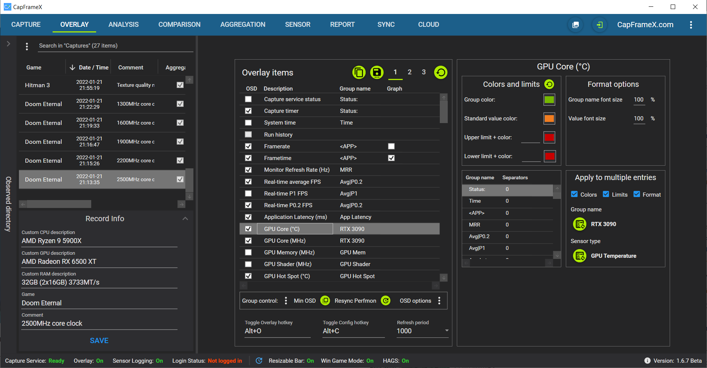
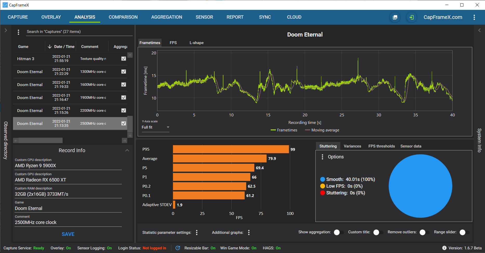
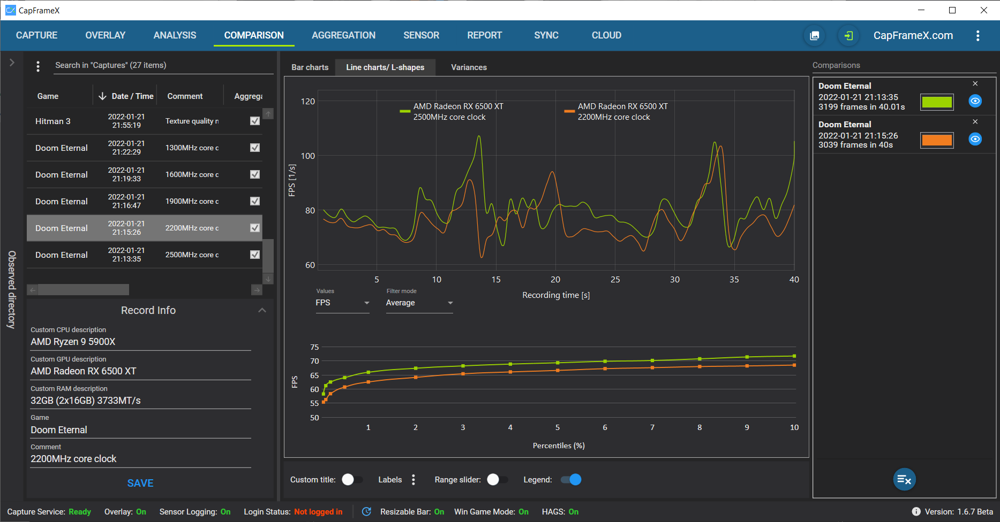
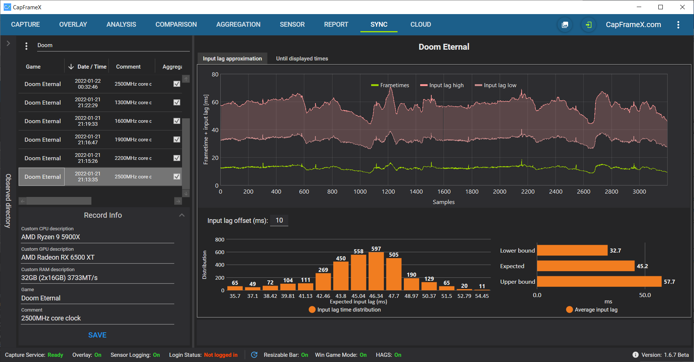
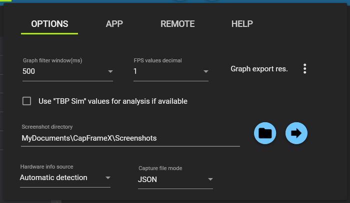

# CapFrameX
Frametimes capture and analysis tool based on Intel's [PresentMon](https://github.com/GameTechDev/PresentMon). Overlay provided by [Rivatuner Statistics Server](https://www.guru3d.com/content-page/rivatuner.html). 

# Remark in our own interest
If you are a reviewer or a youtuber using CapFrameX to get your data, it would be nice to mention us and link to our software.
If you want to use images of the CapFrameX analysis, you could use the built in screenshot function so that our logo and name gets added to the images.

# Release
Download link: https://github.com/DevTechProfile/CapFrameX/releases

# Capture frametimes


# Overlay


# Analysis


# Aggregation


# Comparison



# Sensor


# Synchronization (Input lag)



# Report table (Excel)


# Cloud


# Instruction manual
Learn how to use CapFrameX.

## Record list
This list is always located at the left section, regardless of the view you're currently in.

It constantly observes the output directory so every capture will show up here as soon as the capture has finished.
This also includes every OCAT or PresentMon capture you put into that directory.

Changing directories:  
To change the directory, use the expander on the left where you can select your main folder by double clicking on the address line and get a tree view of all subfolders within that main folder.
Using the right click context menu you can create or delete folders directly in the tree view and also open any selected folder in explorer. You can also move record files to other folders through the context menu in the record list itself.

Changing record info:  
At the bottom of the record list you can see and change the CPU, GPU and RAM description and add a custom comment to every capture.
Also you can edit the game name, since the process name is used as default. 
This gets saved in a process list file that is being compared with a list we update on every new version of CapFrameX to add new games that aren't already on your list. 

## Global Navigation Bar
Located at the top  
Contains all the different views, a screenshot button, a login button (for additional cloud services), a direct link to the CX website and an options menu. 
The screenshot button takes a screenshot of the current view excluding the record list.

## Options (Options tab)

* Graph filter window size = The time period in which the filtered FPS graphs are being averaged (Analysis & Comparison View)
* FPS values decimals = The number of decimals for the FPS values
* Use "TBP Sim" sensor values (AMD graphics cards) if available
* Screenshot directory = The directory in which your screenshots are saved.
* Hardware info source = What will be written into the capture file as your CPU, GPU and RAM config.  
  Automatic detection: What's delivered by the system  
  Custom description: What you write into the text boxes below  
* Capture file mode = How capture files are saved  
  JSON: Standard JSON file  
  JSON + CSV: Additional CSV file that won't be used by CX but can be opened to get a better view on the raw PresentMon data  

## Options (App tab)

* Start with windows & Start minimized = Autostart option and starting in tray
* "Dark Mode" UI color mode
* Receive notifications to get important information about the software and the project

## Capture view
Here you can set your capture hotkey, the capture time (0=unlimited), choose if and how precisely you want to log sensor data (like CPU/GPU load and power) and set the hotkey response sounds.  
An info text always informs you what's going on with the capture service and also tells you what to do in certain situations.
For more detailed information about the capture events, you can take a look at the infobox which can be expanded from the top.

## How to make a capture
The process you want to capture has to be present in the "Running processes" list. This list automatically lists all running processes from which frametimes can be captured.

For the easiest way of just getting into a game and pressing the hotkey to start a capture, this list may only contain one single process, otherwise the service won't know which process you want captured.
If you have more than one process detected, you can still select the one you want and capturing will work just fine.
However you wouldn't want to tab out of your game to do this. This is where our ignore list comes into play.

With the buttons below the two lists you can add or remove any process from the ignore list, the ideal scenario is a completely empty running processes list at the start of CapFrameX.
With this, you can just start your game and since it'll be the only process in the list, just push the hotkey.  
In case a process wasn't detected correctly you can try to rescan processes with the button at the top of the running processes list.

The ignore list entries are drawn from the same process list that contains your game names, which gets updated with our own list on every new Version of CapFrameX.

## Overlay view
Contains the settings for the items displayed in the OSD as well as the settings for a run history and the aggregation function.  

Left side  
Overlay items list where you can set the items you want to see in the OSD and change their order by drag and drop. Items with the same group name will be displayed within a single line.
Three profiles to save different overlay configurations.
Overlay hotkey to show or hide CX items in OSD. This doesn't hide RTSS completely like the Afterburner hotkey does. If you have AB or any other App that uses RTSS running together with CX, only CX items will disappear.
Right side  
Run history and aggregation options  
Run history to set a number of runs for which you get a simple analysis directly in the OSD. If the history is full, any additional run will replace the oldest one.    
Aggregation to combine the runs in the history to a single record file once the history is full, while marking outliers within the history.  
This doesn't take the calculated performance parameters of each record file and calculates an average out of them. It takes the raw frametimes of each record file and puts them into a new file, calculating every parameter based on that set of frametimes.  
Aggregation outlier handling: A full history is checked for outliers using the median of a selectable metric and an also selectable percentage value.
	"Mark & use": Outliers are marked, but all runs will be used for the aggregation.
	"Mark & replace": If outliers exist, you have to do additional runs to replace them. Aggregation triggers when you have a full history without outliers.  

Overlay items options  
Here you can set colors, limits and font sizes for each individual overlay entry. The currently selected entry is always displayed at the top.  
If you want to apply one or more of these settings to multiple entries, e.g. red color above a limit of 95 for all CPU thread loads, you can set them for one entry and then click on the "Sensor type" button at the bottom right side.
This will apply the settings for all entries that are CPU loads. The same is possible for entries with the same group name, e.g. if you want a certain group color for all entries with group name X.
The group name or sensor type for which settings are applied is always displayed next to the buttons.  
At the bottom left side you can set separators for all currently used group names, setting one separator for a group results in an empty line above that group.

## Analysis view
This is where you can analyse the captures you made one by one.

At the tops you can choose between frametime graphs, FPS graphs and L-shapes.  
For the frametime graphs you can set a y-axis scale so that you are always looking at the same ms range for each record.  
For the FPS graphs you can choose a filter mode so that you can either see the raw FPS data or a time based average filter to see a more clear FPS trendline.
Below that you have your performance parameters like min, max, avg and percentiles on the left.  
On the right you have three tabs, the first one is a pie chart which shows the amount of time you had stuttering (frametimes above 2.5x average (default)) or low FPS (frametimes above converted 25FPS (default)), the second one is a diagram where you can see how many frames were below or above specific FPS thresholds.
If you chose to log sensor data for a record, two additional options are enabled: You can see the min, avg and max values of some basic sensors over the course of the benchmark as well as adding additional graphs to show you CPU and GPU load directly in the frametime chart.  
At the bottom is a toolbar where you can change the performance parameters, toggle the additional sensor data graphs, remove unusual outliers from the graphs and activate a range slider that you can also use to cut a record and saving it as a new file.
On the very right side of the page, there is a "System info" expander which shows all the HW and SW information available for the selected benchmark.

## Aggregation view
Here you can manually aggregate records that were already saved.
Add them to the list and set the metrics you want to be displayed as well as the outlier handling options.
Outliers will be marked red and you can choose to include or exclude them for the aggregation. On aggregation you'll see a simple result line and a new record file is created containing all the frametime data of the aggregated records.

## Comparison View
Here you can compare multiple records.  
With a double-click from the record list you can add the captures to the comparison list and with a click on the comparison list entry you can select them in the record list. With the button at the end you can remove them all from the list.

The first tab shows you the records as bar charts.  
If you compare records from just a single game, this game is set as a title above the diagram. If you compare records from multiple games, the names are labeled on the bars.
In addition you have two adjustable contexts that are set as labels for each record.
At the bottom is a toolbar where you can change the sorting and adjust the displayed metrics as well as the contexts.  
For screenshot purposes you can activate "Custom title" to type in a title at the top yourself.
The "Grouping" toggle switches between two sorting modes:  
off-> all records are sorted by FPS  
on-> records are sorted by game, then by FPS  

The second tab shows you the frametime + FPS graphs and L-shapes.  
You can highlight the graphs with a mouseover in the comparison list and also change their color or hide them.
The toolbar now shows you the options to activate the range slider and the context legend for the frametime graphs. The context setting is shared between the two tabs.

## Chart control
| Action | Gesture |
| --- | --- |
Pan | Right mouse button, arrow keys(+ Ctrl = slow pan) |
Pan(X-axis) | Shift + right mouse button |
Pan(Y-axis) | Ctrl + right mouse button  |
Zoom | Mouse wheel |
Zoom(X-axis) | Shift + mouse wheel |
Zoom(Y-axis) | Ctrl + mouse wheel |
Zoom by rectangle | Middle mouse button |
Reset | Left or middle mouse button double-click, ‘A’, Home |
Show ‘tracker’ | Left mouse button |
Copy values| Right mouse button context menu |

You can also zoom/pan a single axis by positioning the mouse cursor over the axis before starting the zoom/pan.  
This manual is also available through the context menu.

## Sensor View
In this view you can choose to log sensor data along with your frametimes. You can freely select any number of sensors available and when selecting a record that contains sensor data, all sensor values are displayed in the list on the right.
These values can be copied to clipboard via context menu, either as min/avg/max values like seen in the list or as raw values with every single sensor reading included.

## Report view
This is a simple view where you can add your records to see all the relevant parameters all at once. You can also just copy them with a right-click to add them into any other program. This is also possible for the graphs and performance parameters in the single record view.

## Synchronization view
This view shows you an approximated input lag analysis as well as some other synchronization details. 

Tab "Approximated input lag"
Using various data from PresentMon, we can give a fairly accurate approximation on the input lag. Note that this doesn't include the additional latency from your mouse/keyboard or your monitor.
For that we've included an offset that you can set yourself depending on your hardware.
This input lag is shown in the graph and in the distribution below as well as a small bar chart for the upper and lower bounds as well as the expected input lag. 

Tab "Until displayed times" 
The chart shows the times when a frame was successfully sent to the monitor and being displayed.
Below the Graph you can see the amount of frames within the valid sync range of your monitor (that you can enter next to it).  
At the bottom you can see the distribution of the until displayed times and beside it another pie chart which shows the number of dropped frames.

## Cloud view
In this view you can upload and download records to easily share them with others.

To upload records, add them to the upload list and click the upload button. Once the upload is complete, you'll get an ID that others can use to download your records in the download section below.
To download records, just add the ID and click the download button.

If you log in before the uploads, you can see all your uploads and IDs on capframex.com. 
The optional description next to the upload button is to name your upload to easily find them on the website. It doesn't have any effect if you're not logged in.

If you activated the process list options on the right, new game names you add and new processes you ignore can be automatically added to our online list and your own list can be synced with that online list so that you always get the latest entries.
This doesn't affect any processes you already have on your list. If our online list contains the same process as yours but with a different game name, your entry will not be changed. The same goes for the ignored status of a process.

## Export options (context menu)
* Analysis: frametime values (f), frametime points (t, f(t)), FPS values, quantiles
* Report: parameter table
* Synchronization: display changed times(dc), histogram data

# Using CX monitoring library in your own projects
The hardware monitoring library is based on [Open Hardware Monitor](https://github.com/openhardwaremonitor/openhardwaremonitor). It is customized and extended with many additional sensors. If you want to use it in your own projects note the following points.
* Import the projects "OpenHardwareMonitorLib" and "CapFrameX.Monitoring.Contracts"
* Allow unsafe code in the build options of the project "OpenHardwareMonitorLib"
* Implement "IProcessService" (see sample code)
* Install all necessary Nuget packages: 

```packages.config
<packages>
  <package id="Microsoft.Extensions.Logging.Abstractions" version="5.0.0" targetFramework="net472" />
  <package id="Newtonsoft.Json" version="12.0.1" targetFramework="net472" />
  <package id="Serilog" version="2.9.0" targetFramework="net472" />
  <package id="System.Buffers" version="4.5.1" targetFramework="net472" />
  <package id="System.ComponentModel.Annotations" version="4.7.0" targetFramework="net472" />
  <package id="System.Memory" version="4.5.4" targetFramework="net472" />
  <package id="System.Numerics.Vectors" version="4.5.0" targetFramework="net472" />
  <package id="System.Reactive" version="4.3.2" targetFramework="net472" />
  <package id="System.Runtime.CompilerServices.Unsafe" version="5.0.0" targetFramework="net472" />
  <package id="System.Threading.Tasks.Extensions" version="4.5.4" targetFramework="net472" />
  <package id="System.ValueTuple" version="4.5.0" targetFramework="net472" />
</packages>
```

Potential conflicts with the Nuget packages can be solved via Package Manger Console. Just type "Update-Package -reinstall". The calling application must run as administrator. See "MonitoringLibTestApp" example code how to integrate the customized library.

# Requirements
* .NET 4.7.2
* Microsoft Visual C++ Redistributable Package

# Build requirements
* MS Visual Studio 2019 only (Community Edition)
* WiX V3.11.1
* WiX Toolset Visual Studio 2019 Extension
* WiX Toolset and VS Extension: http://wixtoolset.org/releases/

# Build settings
* Solution Platform x64

# Dev roadmap
* Enhancements


