# CapFrameX 1.9.2 overlay designer

The designer is a reusable WPF control with a larger independent editing window. It creates
native CapFrameX OSD designs, previews them using the actual renderer, and supplies saved
designs to the hook-free and in-game DXGI/Vulkan renderers. The Overlay tab exposes the saved
design selection and preserves the existing row overlay configuration. The two tabs are named
**Row overlay** and **Tile overlay**; renderer selection is separate from content selection.

## Row overlay inside a design

Drag **Add → Row overlay** onto the preview, or select **Hybrid Benchmark**, **Hybrid Compact**
or **Hybrid Thread Deck** from the **Row + tiles** template category. The block follows the
active row profile: enabled rows, order, grouping, colors, thresholds, units, precision,
percentage bars, separators, run history and graphs. **Edit row profile** opens the existing
Overlay items editor; it minimizes the designer without discarding the working design.

The block moves and resizes as a single grid tile. Row scale adjusts its internal text size;
the frame clips overflow so other tiles retain their positions. Increase its height to show
more rows. Live preview uses the actual profile and shared telemetry without enabling any OSD
or acquiring an RTSS slot; demo preview uses labelled sample rows. Switching the row profile
also changes linked blocks. Row settings are not copied into or overwritten by the design.

The native standalone and embedded row layouts use the same builder. Classic values have
separate storage from design metrics, preventing same-key collisions. Hook-free, DXGI and Vulkan
continue receiving classic snapshots while a design is active; values update without rebuilding
the scene, and empty/stale in-game snapshots clear the linked block. Graph-feed demand is the
union of design charts and enabled classic graphs. RTSS's existing row formatter is unchanged.

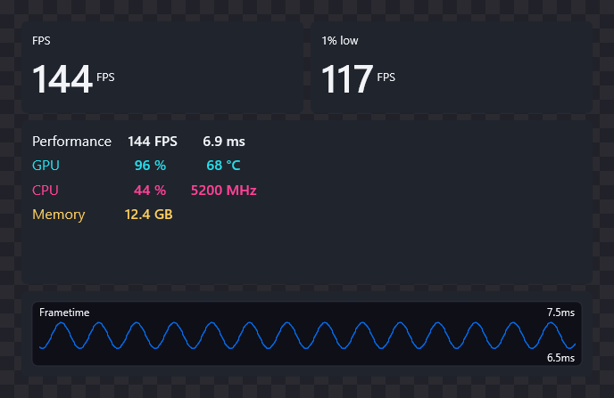

Hybrid validation (2026-10-09): the CapFrameX regression selection before the context-menu update passed all 526 tests.
Editor verification passes 1,448
checks and native preview 1,129 checks for 59 templates. Seven native core suites (245 design
assertions), 32 DXGI suites per architecture and two Vulkan suites per architecture pass.
Actual mouse checks in the production designer hosted with isolated demo telemetry cover
template selection, row-block resizing/moving, Undo, saving and disabled activation under RTSS.
Production Overlay page checks pass in dark and light themes at 1120×780 and 1480×880.
Each of the four variants verifies Row/Tile labels, twelve starter profiles, both native
renderer choices, visible activation, RTSS hiding Tile overlay and returning to Row overlay,
and native renderer selection restoring availability without activating a design.
Real game/RTSS compatibility and release signing remain final release checks.

## Try the designer

Open **Overlay → Tile overlay → Open designer**. `CapFrameX.exe --overlay-designer` remains available
for development; opening the editor again brings its existing window to the foreground. The
separate designer window inherits the application's current MaterialDesign theme and can be embedded using
`CapFrameX.View.Controls.OverlayDesignerControl`, without changing the neutral editor.

Select an in-game or hook-free CapFrameX renderer, then choose **Use selected tile overlay** in the
Tile overlay tab or **Use tile overlay** inside the editor. Explicit activation also turns on
overlay visibility; opening the app, browsing profiles and refreshing the library do not.
Selecting RTSS immediately deactivates and hides the Tile overlay tab and uses the existing row
entries. Design activation is disabled under RTSS, including at startup with a persisted
design selection. Switching back to a CapFrameX renderer leaves Row overlay selected until
the user explicitly activates a design again. Saved designs and the editor selection survive.
Returning to **Row overlay** restores those entries without deleting saved designs. The active
runtime design is independent of the profile currently being edited; saving changes to the
active design updates its runtime snapshot. Unsaved editor changes remain local to the editor.

Right-click a saved tile profile to **Open in editor**, **Show in overlay** or **Delete**.
Opening reuses the designer and preserves its Save / Discard / Cancel prompt for unsaved work.
Delete requires confirmation for the clicked profile; **Cancel** or Escape leaves it intact.
Deleting the active profile returns to Row overlay only after the library write succeeds,
without changing the renderer or overlay visibility. The last saved profile cannot be deleted.

Context-menu validation (2026-10-09): all 552 selected CapFrameX regression tests pass,
including clicked-profile routing, unsaved-edit Save / Discard / Cancel, concurrent library
changes, failed writes, RTSS gating and active-profile deletion. The production WPF view passes
menu and confirmation-dialog checks in light/dark themes at 1120×780 and 1480×880 with isolated
QA profiles. Debug and Release source builds pass.

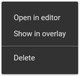
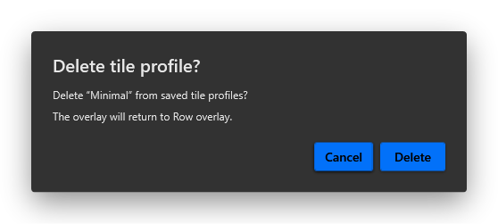

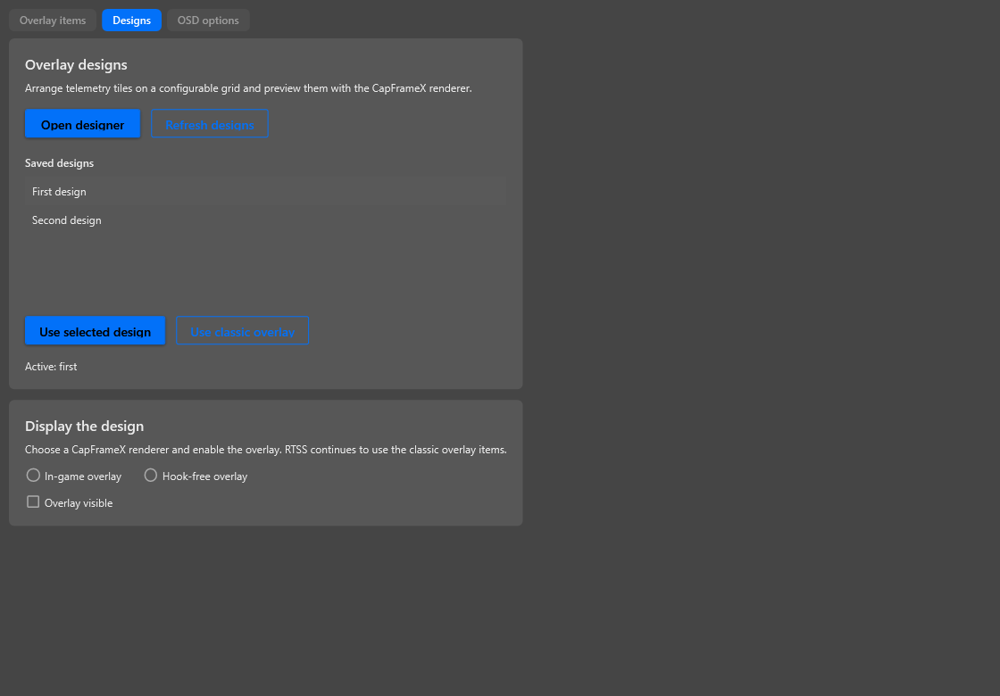

The host now includes a saved-design toolbar: **New**, **Duplicate**, **Rename**, **Delete**,
**Save**, **Import** and **Export**. Ctrl+S saves the selected profile. Duplicate saves the current
working design as a separate profile; Import creates a new profile from an exported design.
The last selected profile reopens automatically. Profile changes and both designer-window and
application shutdown offer Save / Discard / Cancel for unsaved edits, including invalid numeric
input. Undo history is reset between profiles. At least one profile is retained.
The designer remains frozen while application shutdown prompts are pending; Cancel restores
editing. A profile rejected by the renderer leaves the editor read-only so the previous visible
document cannot accidentally overwrite the newly selected profile.

The library is stored at `IPathService.ConfigFolder/OverlayDesigns/profiles.json`, so installed
and portable configurations use their existing paths. Writes replace the library atomically,
retain a previous backup and detect concurrent writers. A corrupt primary can recover from its
backup; the damaged original is retained on the next write. Unreadable or newer libraries are
never overwritten, and the editor becomes read-only if the library cannot be opened.

The Tile overlay tab receives twelve saved starter designs on first use, before opening the
designer: **Benchmark**, **Compact**, **Minimal**, **Frame Pacing**, **GPU Dashboard**,
**Memory Watch**, **Vertical Thread Strip**, **Vertical Clock Deck**, **Vertical Thermal Panel**,
**Hybrid Benchmark**, **Hybrid Compact** and **Hybrid Thread Deck**. These are actual library
profiles, separate from the 59-template gallery, and can be edited, renamed or deleted normally.

`OverlayDesignStarterCatalog` embeds canonical editable canvas scenes in the Integration assembly,
so initialization does not load the optional WPF Controls assembly. Startup service and designer
use the same bootstrap method. Deterministic starter IDs and `StarterCatalogVersion` are saved
atomically with the new profiles. Existing profiles, same-name custom designs and the last editor
selection are preserved. Seeding does not select or activate a runtime design. The completion
marker prevents deleted or renamed starters from being recreated, including after ordinary saves.
Concurrent first-open attempts share a bootstrap gate while normal writes retain stale-writer
checks. Read-only libraries stay readable; failed or recovered libraries are not replaced by
automatic starter initialization. Recovery and initialization warnings remain separate.

Untouched starters retain semantic bindings for runtime source resolution. When opened in the
designer, their sources are bound to the available hardware and saved as the initial baseline;
that automatic binding does not add an Undo step. Edited, imported and previously bound designs
keep their exact bindings. Empty source discovery does not consume the deferred binding attempt.

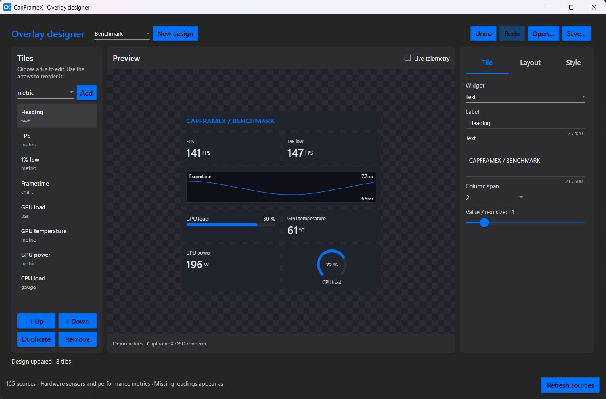

For a standalone demo without hardware initialization, build and run
`../CapFrameX.OSD/CapFrameX.OSD.Editor.Demo` in the sibling OSD checkout. That host uses
explicitly labelled demo data.

1. Open **Templates (59)**. Search or filter by category; drag a card onto the preview,
   double-click it or choose **Use template**. Undo restores the previous design.
2. Drag widgets from **Add** onto the preview. Click a rendered tile to select it, then drag
   it to a new grid position. An insertion marker shows where it will land.
3. Drag the right or bottom handle to resize a tile on the fine grid. Ctrl-drag duplicates;
   the remove zone below the preview deletes.
   Escape cancels a gesture; every completed gesture is a single undo step.
   Resizing uses a snapped outline from a fixed pointer origin and commits on release. The
   renderer stays stable during the gesture; width stops at the canvas edge instead of repeatedly
   reflowing the design. Legacy flow profiles retain column-span and content-size handles until converted.
   New template selections use a fine grid with independent tile X/Y positions, width and height.
   The default cell is 8 pixels; the Layout inspector accepts a cell size from 1 to 128 pixels,
   with independent grid visibility and snapping switches. Moving a tile does not rearrange
   its neighbors. Legacy flow profiles remain unchanged when opened; enabling Fine grid or
   the first placement gesture converts their measured geometry in one undoable action.
   In this mode the handles resize the tile frame itself. Coordinates and frame dimensions
   are also editable numerically. Left and right sidebars start wider and have draggable splitters.
4. Drag a source from **Sources** onto a metric, bar or gauge to replace its binding, label
   and unit. Drop in empty space to create a metric. The **Tiles** list also supports drag
   ordering. Text, labels, ranges, grid settings and colors remain editable in the inspector.
   Sources are grouped by category and metric family, with a category filter and multi-term
   search across devices, names, units and source IDs. Text sources bind to metric tiles;
   numeric sources also work in bars and gauges. Run history reserves eight lines by default;
   **Text lines** changes the reserved space without telemetry-driven reflow.
   Sources now browse as **category → device → metric family**, initially collapsed, with a
   device filter, natural numeric order, an Expand all option and search that expands results.
   Switch **All readings** to **Groups** for repeated CPU readings. Drag one group onto the
   preview (or use Add group) to create one tile containing all its member bindings.
   Core/thread loads, core clocks, effective clocks, temperatures, thermal headroom, SMU core
   power and VID use separate families; aggregate Total/Max/Average readings are excluded.
   Choose metric or bar display and shared colors, range, decimals and maximum readings per row.
   Bar groups also offer **Horizontal** or **Vertical** orientation. Vertical columns fill
   from the bottom, with member labels below and optional values above. Disable **Show values**
   and reduce the shared bar height for a compact CPU load/clock panel. Up to 32 readings per
   row can be requested; the actual count adapts to the available width and label/value space.
   **Fit group to content** adjusts a canvas group's frame after changing its appearance,
   without moving neighboring tiles; the change supports Undo. Growth that would increase
   overlap with another tile is rejected before changing the frame.
   Narrow layouts reduce the actual column count to keep labels readable. Member checkboxes
   exclude individual readings; Refresh adds newly discovered members while retaining missing
   and excluded bindings. Up to 128 readings can be configured as one movable/duplicable tile.
5. Enable Live telemetry for CapFrameX readings. Frame charts require a selected or uniquely
   detected running game and the PresentMon service. Recording and the in-game overlay may
   remain off. No synthetic frame values are substituted in live mode.
6. Save the design as JSON and reopen it later, including by dropping the file onto the
   preview. Buttons and keyboard shortcuts remain available alongside drag and drop.

The gallery contains 59 independently editable, original templates in eight categories:

| Category | Templates |
| --- | --- |
| Essentials | Benchmark, Compact, Minimal |
| Gaming | Ribbon, Corner Stack, FPS Focus, Esports, Ultrawide HUD |
| Analysis | Frame Pacing, Frame Comparison, Smoothness Lab, Latency Lab, Benchmark Pro |
| Hardware | GPU Dashboard, CPU Dashboard, Thermals, Memory Watch, Power Lab, Hardware Matrix, Sensor Sidebar |
| Studio | Stream Strip, Capture Card, Cinema, Light Slate |
| Hardware groups | CPU Thread Deck, CPU Clock Matrix, Hardware Group Console, CPU Thermal Matrix, Vertical Thread Strip, Vertical Clock Deck, Vertical Hardware Panel, Vertical Thermal Panel |
| Row + tiles | Hybrid Benchmark, Hybrid Compact, Hybrid Thread Deck |
| Troy-inspired | Ghost Benchmark, Two-Tone Console, 1080p Benchmark, Telemetry Tower, Dual Hardware, GPU Focus Pro, CPU Focus Pro, Frame Pipeline, Memory Rails, Power Station, Clockwork, Cooling Bench, Low FPS Lab, Pacing Desk, Latency Sidebar, Benchmark Footer, Quad Telemetry, Compact Two-Tone, Capture Session, Efficiency Desk, Sensor Rails, Wide Benchmark, Display Pacing, Minimal Benchmark |

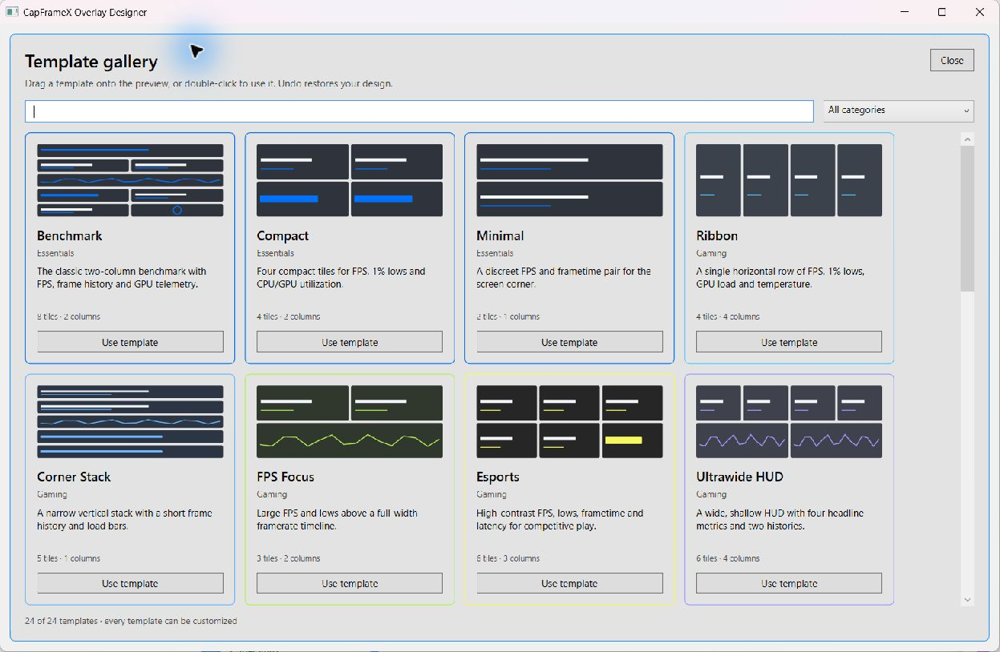

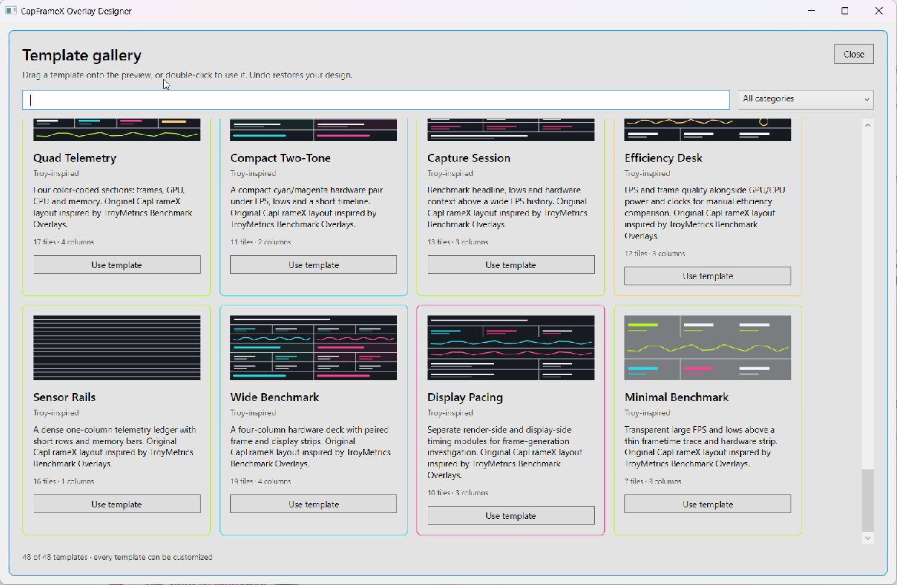

The Troy-inspired category uses compact hardware sections, prominent FPS/lows, long frame-history
strips and contrasting CPU/GPU colors inspired by the TroyMetrics visual examples. Tile
colors can override the design defaults; clearing an override restores inheritance.

The Hardware groups presets resolve complete CPU load, clock, effective-clock and temperature
families from the current source catalog. Group panels grow to accommodate the discovered
members; shared styling and member selection avoid configuring individual threads one by one.

The four Vertical presets provide compact load, clock, hardware and thermal panels. At 560 px
width, a real 32-thread group with labels C1 T1 through C16 T2 measures 334.9 px high with the
previous horizontal layout and 196.1 px with 32 px vertical tracks and hidden values: 41% less
height. Bar height, direction, values and requested columns remain independently adjustable.

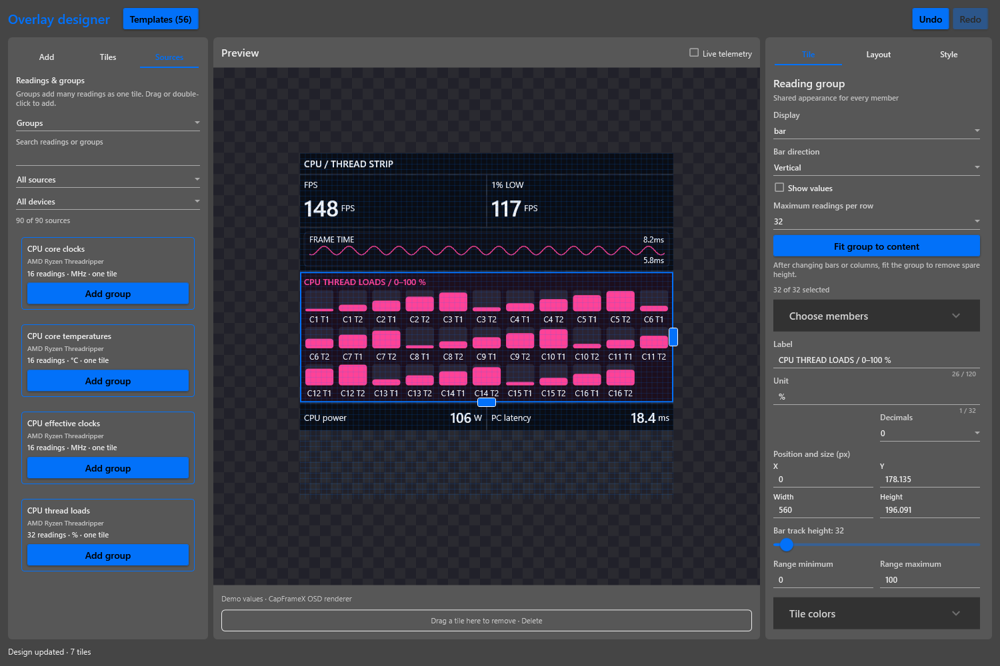

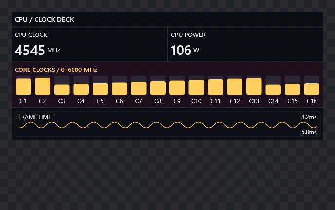

These are CapFrameX-native profiles. RTSS `.ovl` files are not imported. The reference is
[TroyMetrics/Benchmark-Overlays](https://github.com/TroyMetrics/Benchmark-Overlays); the bundled
presets are newly authored and contain no copied artwork, layouts or fonts.

The reference repository was checked out locally under `temp/references/Benchmark-Overlays`
at `2352cd4b094402905768cd1b9aba7689c278d2e9` for the group-design study. That revision contains
the README and reference images/GIFs, not editable `.ovl` files. Its compact adaptive CPU block,
common module headings and consistent accents informed the group interaction. No reference
assets were added to the product. The checkout is ignored by the CapFrameX repository.

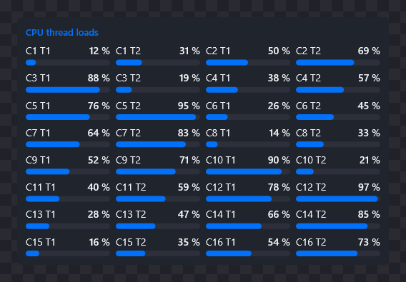

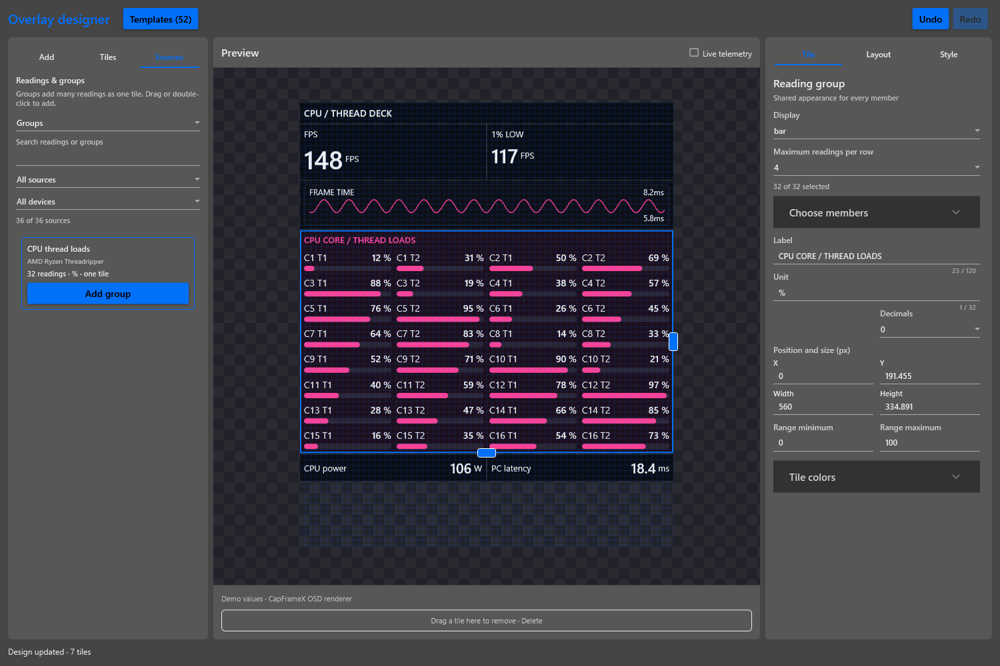

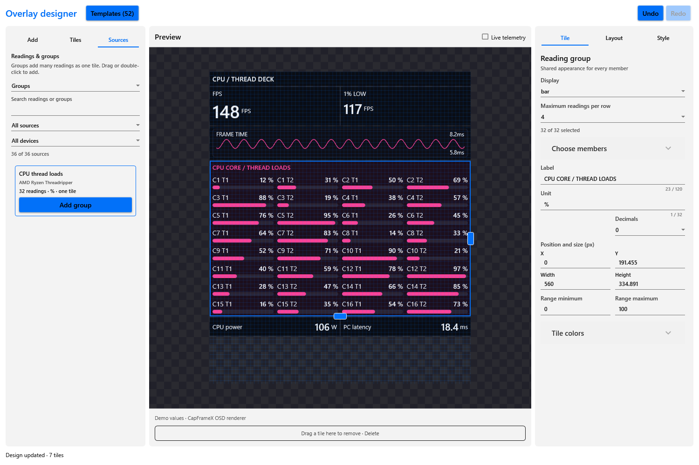

## Ownership and interfaces

| Component | Responsibility |
| --- | --- |
| OSD `CapFrameX.OSD.Controls.OsdEditorControl` | Typed design editing, presets, JSON import/export, native preview host |
| OSD `CapFrameX.OSD.Interop.OsdPreview` | Preview lifetime, template, scalar snapshot and frame-sample C APIs |
| `CapFrameX.View.Controls.OverlayDesignerControl` | CapFrameX theme, full catalog, visible-live demand, bounded UI feed |
| `CapFrameX.OSD.Integration.OverlayTelemetryService` | Stable sensor sources, live values, non-consuming frame/PMD metrics |
| `CapFrameX.OSD.Integration.OverlayPreviewFrameFeed` | Selected-process filtering and history reset on target changes |
| `CapFrameX.OSD.Integration.OverlayDesignProfileStore` / `OverlayDesignProfileSession` | Atomic library persistence, selected profile and unsaved-edit lifecycle |
| Native OSD `Widget`, `Config`, `PreviewInstance`, `OsdInstance` | Shared layout, rendering, validation and custom-template mode |

The editor has no dependency on CapFrameX services. A host supplies `Sources`, switches
`IsLivePreview`, and calls `SetMetricsJson`, `PushSamples` and `ResetSamples` on the UI thread.
`TemplateChanged` and `GetTemplateJson()` expose the current valid native design.
`DocumentEdited` also reports invalid/pending model edits; `HostManagesFiles`, `SaveRequested`
and `ResetHistory()` allow the embedding host to own profile commands and change boundaries.

The interactive preview renders native pixels into a WPF `WriteableBitmap` at up to 20 Hz.
There is no native child window covering mouse input or selection adorners. The native API
returns the actual fitted tile rectangles; selection, insertion feedback and resize handles
therefore use the same geometry as rendering, including DPI conversion. The host bounds
preview memory to four million pixels and disposes the raster on unload.

The CapFrameX wrapper accepts `IOverlayTelemetryService` and an optional
`IObservable<OverlayPreviewFrame>`. The host owns the service. The control releases its own
subscriptions and demand when unloaded, hidden, minimized or switched to demo mode.

## Data contract

Hardware sources come from `ISensorService.GetSensorEntries()`, including enabled optional
providers. Discovery runs off the UI thread. The catalog is independent of the enabled entries
in a classic overlay profile and respects the application's global hardware/provider selection.

Bindings persist opaque stable IDs derived from the sensor's hardware name, type and name.
Runtime identifiers are retained for snapshot lookup. Ambiguous stable names are qualified by
runtime ID instead of silently selecting a different device. Missing devices/bindings remain
in the document and display an unavailable value.

Preview subscriptions reuse `SensorSnapshotStream`; they do not introduce a second hardware
polling loop. An all-sensor lease composes with the Info tab's existing demand. Online frame
metrics have a separate demand lease, and PMD reads use a detached latest-sample cache rather
than consuming the classic overlay's power buffers. Missing/non-finite or stale frame/PMD
values are represented by JSON null. Units follow the actual CapFrameX producers.

The source catalog also includes every declared classic overlay entry, connected-display
resolutions and process/API metadata. Capture status/timer, run results/aggregation/outlier
count, battery, ping, system time, hardware labels, driver/OS information and frame-generation
status remain selectable regardless of the classic renderer's configuration. A disabled or
unavailable producer supplies no value. Profile visibility and ordering are never modified.
`OverlayTelemetrySnapshot.MetricValues` carries numbers, strings and null; the existing numeric
`Values` property is retained. Text values are bounded at Unicode boundaries to fit the native
2048-byte protocol limit, preventing one long label from rejecting the entire snapshot.

PresentMon preview charts use real timestamped rows from the selected process. Target changes
clear history; malformed/non-finite timestamps and foreign-process samples are rejected.
The UI drains at most 4,096 buffered samples every 200 ms and disposes the feed when unused.

## Native design schema

The version 1 JSON scene remains backward compatible. New primitives/properties include:

- `panel.layout`: `vertical`, `horizontal`, `grid`, or `canvas`; flow layouts retain
  `columns` and child `colSpan`, while canvas children use explicit frame coordinates/sizes.
- Per-panel `width`, `gap`, `padding`, `radius` and `color`.
- Metric `valueSize`, `unitSize`, `width`, `labelPosition` and optional `valueLines` (1–16).
- `bar`: keyed numeric value, minimum/maximum, unit, value text and configurable track.
  Optional `orientation: "vertical"` draws bottom-up columns; omitted orientation retains
  horizontal rendering. `height` specifies track height and `showValue` controls numeric text.
  Vertical labels sit below the track and numeric values above it. A missing reading shows a
  dash, including inside the track when numeric values are hidden, to distinguish it from zero.
- Explicit unavailable values, separate from a measured zero.

The first visual editor exposes metric, text, frame-history chart, bar and gauge tiles. Native
custom templates use a render-thread handoff so an incoming classic entry update cannot replace
the custom widget tree. Clearing template mode restores the classic entry rendering path.
Native preview and live renderers share these primitives; the preview additionally fits the
design into its viewport. Design JSON is validated before replacing the last good document.

## Runtime integration

`OverlayDesignService` owns the selected runtime profile, stored in
`ActiveOverlayDesignProfileId`. `OverlayDesignRuntimePublisher` acquires a telemetry lease only
while a selected design needs visible native output. It extracts keys from the compiled native
scene, so enabled group members and individual widgets are included while excluded members
remain absent. Unavailable or stale values remain unavailable; semantic aliases only resolve
when one unambiguous source is available.

Hook-free rendering consumes the shared runtime snapshots directly. In-game renderers consume
the bounded `Global\CfxOsdDesignV1` channel (64-byte header and separate 1 MiB UTF-8 regions for
scene and keyed metrics). The pointer-free layout is identical for x64/x86 DXGI and Vulkan.
Readers require the exact target PID, stable publication sequence and a heartbeat no older than
three seconds. Design and metrics revisions avoid re-parsing unchanged content. The atomic
`cfx_osd_apply_design_json` API validates both payloads before changing either; a rejected update
preserves the last accepted scene and values. Disabling custom designs restores classic output.

Group tiles compile to nested native panels; the fine grid uses a native canvas panel with
fixed per-tile frames. Editor metadata is retained in saved profiles and stripped from runtime
transport. Template swaps preserve the user's live overlay placement and zoom. Zoom rebuilds
custom geometry from the canonical authoring scene, avoiding cumulative scaling. Classic
entries can still update legacy custom templates; the new atomic API owns an exclusive keyed
snapshot so colliding legacy entry names cannot overwrite its telemetry.

Arbitrary nested composition, hardware history charts,
state rules/animations, artwork and RTSS import are separate extensions. Frame-history charts
currently use frametimes, display times or frame rates. All exposed CapFrameX hardware values
can be selected for numeric widgets, bars and gauges.
Text telemetry uses metric tiles with a fixed, configurable line count.

## Build and validation

Development uses a separate sibling checkout: `E:\Code\CapFrameX.OSD` beside
`E:\Code\CapFrameX`. Build native core with CMake, then managed Interop/Controls.
Build CapFrameX and its MSTest project with Visual Studio MSBuild in
`Release|x64`; run the DLL under `net10.0-windows`. Public builds use the matching Interop,
Controls and native DLLs from `external/CapFrameX.OSD-prebuilt`.

Visual Studio builds the optional managed OSD dependencies through
`source/Directory.Build.targets` before resolving their references. They remain outside the
public solution so a checkout without private OSD sources still builds with the prebuilts.
`source/Directory.Build.props` selects source/prebuilt mode before project references are
evaluated. It uses the sibling checkout, with prebuilt binaries as the fallback when source
is unavailable. Override `CfxOsdSourceDir` for another
location; the legacy `CfxOsdSubmoduleDir` override remains supported. Paths work with or
without a trailing directory separator. `CfxOsdFromSource=false` selects only prebuilt
managed and native payloads even when a source checkout is present.
IDE source edits participate in its up-to-date check; design-time evaluation does
not start recursive builds. A cold `Debug|x64` build with Visual Studio's reference-build flags
is verified, including the application, WPF views and test project.

Sibling-checkout validation (2026-10-09): 24 MSBuild evaluations pass 337 path/mode assertions.
All five native DLLs rebuild from the standalone checkout. A source Debug app build and a
prebuilt-only Release app/test build pass in isolated output directories; the normal Debug
output was locked by a running app. Sixteen editor layout/renderer compatibility tests pass.
Native DLLs and Vulkan manifests match the selected source outputs; all seven prebuilt DLLs
and both manifests match the prebuilt-only output. The duplicate local submodule checkout,
its repository definition and gitlink have been removed. The standalone OSD repository
retains the full history; the payload's source revision remains recorded in the prebuilt README.

Changes to shared native layout/rendering require rebuilding the core and both architectures
of the DXGI hook and Vulkan layer. Development binaries must be signed again for a release.

On the development machine, both HKLM Vulkan registry views still referenced the installed
`Program Files (x86)/CapFrameX/vulkan[/x86]/cfx_osd_vklayer_v1.json` manifests. That installed
layer lacks the custom design channel support present in the Debug payload, whose hashes differ.
Rebuilding CapFrameX alone therefore does not switch Vulkan games to the new layer. Use the
scoped `scripts/Register-DevelopmentVulkanLayer.ps1` helper from an elevated PowerShell to point
each registry view at the matching development payload. It validates both architectures,
records a local backup, changes only CapFrameX layer registrations and supports restoring the
previous HKLM registrations. Stale HKCU registrations are removed because elevated Vulkan
processes ignore them and they can shadow the proper bitness. No registry update is performed
by builds or by opening the designer. Already running Vulkan games must be restarted after
changing the registration; installer-owned production registration remains unchanged by source edits.

Validated on 2026-10-09:

- Vertical-group update: 133 focused CapFrameX tests, 1,342 editor checks and 852 native-preview
  checks pass for all 56 templates. Tests cover old horizontal JSON byte compatibility,
  persistence/runtime activation, Undo, safe fitting, 32/64/128 actual thread labels, unavailable
  readings, long captions, and authoring scale 0.5–2 combined with runtime zoom.
- Updated native core passes seven suites with 202 design assertions, with 32 DXGI tests and
  two Vulkan tests per architecture. Real x64/x86 DX11, DX12 and Vulkan hosts render vertical
  columns and exercise invalid updates, visibility, wrong targets and expiry. The production
  designer with isolated demo telemetry was also checked by mouse for template selection,
  numeric values, collision rejection, Undo and save. New screenshots cover all four presets
  in both application themes. Real hardware/game compatibility remains a release check.
- Final Debug source and Release prebuilt-only builds pass. The seven staged OSD DLLs match
  the Release application output by SHA-256; both Vulkan manifests are identical. Native
  payload signing remains pending access to the existing Certum private key.

Fine-grid/runtime validation before the vertical-group update:

- 129 focused CapFrameX tests pass, covering runtime selection/publication, profile persistence,
  telemetry, source parity, command handling, localization and WPF lifecycle/validation.
- 1,121 editor checks and 629 native-preview checks pass for all 52 templates. Grid checks
  include fractional preview scales, measured legacy conversion, independent move/resize,
  single-step undo, bounds, small cells and 32/64/128-member groups. Hidden-tab filter tests
  verify the displayed selection after catalog refresh, including disappearing devices.
- All seven focused native core suites pass (134 design checks), as do all 32 DXGI tests per
  architecture and both Vulkan tests per architecture. All five native DLLs were rebuilt.
- Live DX11/DX12/Vulkan test hosts exercise saved designs, invalid-update retention, hiding,
  retargeting and timeout. Vulkan GPU readback confirms zero overlay pixels when disabled and
  proper 200% scaling. These are graphics test hosts, not a claim of compatibility with every game.
- Actual mouse interaction in the production designer, hosted with isolated demo telemetry,
  verifies legacy conversion, custom cell size, independent tile and 32-thread group drag/drop,
  edge resizing, sidebar resizing, undo, saving and runtime-profile activation. Dark/light
  previews use the actual application resources. Full elevated-app hardware/game integration
  remains a separate final release check.
- The actual Overlay view's Designs tab was rendered and checked with its view model at
  1120×780 and 1480×880 in light/dark themes, including selection, activation status and all
  renderer controls. All controls fit without clipped labels.
- Release and Debug source builds and the Release prebuilt-fallback build pass. All seven
  staged files match the final app output by SHA-256; PE architectures and identical Vulkan
  manifests were checked. Build provenance and hashes are recorded in the prebuilt README.
- Certum signing was attempted but the private key was unavailable to SignTool. These are
  unsigned development binaries; no installer or update-server release was published.

Earlier validation history (2026-10-08):

- Main application builds with source references and with `CfxOsdFromSource=false`.
  The fallback also works with an initialized submodule; it stages the native preview DLL.
- 36 targeted CapFrameX tests pass for catalog bindings, unavailable/stale values, demand
  leases, existing polling behavior and selected-process frame delivery.
- 42 editor verification checks pass, including round-trip validation, layout bounds,
  undo/redo and persistent diagnostics when the native renderer is unavailable.
- Four focused native core suites pass; DXGI passes 30 tests per architecture and Vulkan
  passes two tests per architecture. All five native DLLs were rebuilt.
- The actual CapFrameX window renders the native demo preview with the application theme
  and discovers 155 sources on the development machine. Live subscription behavior is covered
  by automated tests; interactive live switching in the elevated application was not verified.

The drag-and-drop update was additionally validated with 387 document/template/gesture/gallery
checks, 245 native-preview checks covering all 24 templates, 102 native design checks, 30
CapFrameX telemetry/polling tests and the 64 DXGI/Vulkan tests. Interactive mouse checks
confirmed palette insertion, direct preview reordering, width resizing and source binding;
the gallery was opened and visually checked. Its WPF templates are realized by a regression
test to catch errors that appear only when opening the gallery.

The subsequent templates/source/resize update passes 914 editor checks, including category
filtering, multi-term search, 512-source grouped realization, text binding, pointer hysteresis,
stationary-pointer and row-edge resizing, cancel/no-op behavior and a single commit/undo per
gesture. All 48 templates pass 494 native-preview checks, including stable multiline text
updates. Native verification passes 127 design checks and all 68 selected CTest suites across
core, x64/x86 DXGI and x64/x86 Vulkan. The expanded CapFrameX source-parity suite passes 43
tests. Source and prebuilt-fallback application builds succeed. New templates were visually
checked in the independent demo host; the gallery screenshot above shows its neutral theme.

The sidebar-tab fix is also verified against the actual MaterialDesign 3 resource dictionary:
four MSTest cases cover both light/dark themes at 940×560 and 1280×820, all six sidebar headers,
and the realized source list after selecting Sources. The former theme-sized headers required
270 pixels in a 196-pixel palette, clipping Sources; the local tab templates now share the
available width. The existing 914 editor checks still pass.

The profile/group update passes 84 focused CapFrameX tests, 962 editor checks and 536 native
preview checks. These include atomic-save failure and recovery, save/discard/cancel, actual WPF
numeric validation, immediate dirty tracking, invalid-edit undo, profile-switch history isolation,
shutdown editing guards, renderer-rejected profile isolation, source classification for
32 threads/hybrid/identical devices, group member edits, and native
32/64/128-member layouts with one outer hit area. Debug and Release source builds, the Release
prebuilt-fallback application build and the Release test build pass.
Direct desktop interaction could not be completed unattended: the full app required UAC and the
isolated UI host required Computer Use app approval. Automated WPF and native-renderer checks
do not substitute for a final interactive check with real hardware telemetry.

The hybrid OSD implementation is published through
`c96c00296225a76b92ad6ab0c0fa3765558bc13d` on `main`.
Matching prebuilt files, hashes and signing status are documented in
[`external/CapFrameX.OSD-prebuilt/README.md`](../external/CapFrameX.OSD-prebuilt/README.md).
