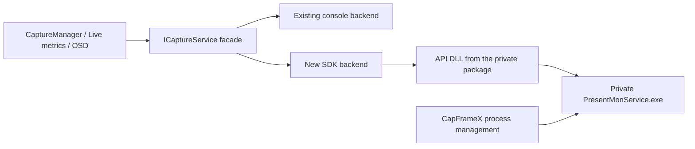

# Development Plan: PresentMon Service for CapFrameX

Date: 2026-09-25

Status: Development plan; the service backend has not been implemented or validated in practice.

Reference: PresentMon v2.6.0 and the current CapFrameX codebase targeting .NET 10 / Windows x64.

## 1. Goal and requirements

Enable CapFrameX to obtain frame data through the PresentMon SDK from a `PresentMonService.exe` instance that it launches itself. The existing Console Application remains available throughout development and evaluation and initially remains the default.

The portable distribution determines the initial deployment model:

- CapFrameX bundles the required executable and matching DLLs.
- CapFrameX directly launches, configures, monitors, and stops its own service instance.
- This capture path requires no additional installation or registration of a PresentMon Windows service.
- Selecting the private instance and API DLL must not depend on a system-wide PresentMon installation.
- Starting, restarting, or closing CapFrameX must not modify or terminate an existing Intel PresentMon service.
- Paths are resolved relative to the CapFrameX package; PresentMon logs follow the configured CapFrameX paths.

These requirements apply to PresentMon. Existing prerequisites for the portable distribution, such as runtime libraries and Vulkan layer registration, remain separate concerns. The migration also does not promise that all of CapFrameX can run without administrator privileges.

Process selection, hotkey captures, capture duration, live metrics, OSD, sensor alignment, swapchain filtering, and loading existing recordings must be preserved. Display-layer analysis must also be preserved before changing the default backend.

The initial implementation excludes replacing our sensor providers, adopting Intel's overlay or statistical calculations, connecting to arbitrary installed services, and converting all consumers to typed frame objects.

## 2. Current implementation and verified differences

### CapFrameX

| Location | Current behavior / relevance to migration |
|---|---|
| [PresentMonCaptureService.cs](../source/CapFrameX.PresentMonInterface/PresentMonCaptureService.cs) | Launches the Console Application, reads stdout as CSV, and publishes `string[]` rows. Discovers processes from this stream. |
| [PresentMonServiceConfiguration.cs](../source/CapFrameX.PresentMonInterface/PresentMonServiceConfiguration.cs) | Builds console arguments for PC Latency, the circular buffer, the exclusion list, and display metadata. |
| [ICaptureService.cs](../source/CapFrameX.Capture.Contracts/ICaptureService.cs) | Provides a shared interface, but includes CSV headers, column indices, and a process-oriented startup contract. |
| [CaptureManager.cs](../source/CapFrameX.Data/CaptureManager.cs) | Handles recording, the pre-capture archive, delayed frames, and QPC-based selection; still generates console startup parameters. |
| [RecordManager.cs](../source/CapFrameX.Data/RecordManager.cs) | Interprets columns and persists data, including display-layer information. |
| [OnlineMetricService.cs](../source/CapFrameX.PresentMonInterface/OnlineMetricService.cs) | Calculates live metrics from frame rows; also uses static indices from the console implementation. |
| [Bootstrapper.cs](../source/CapFrameX/Bootstrapper.cs) | Registers the backend and passes column indices to OSD consumers. |
| [App.xaml.cs](../source/CapFrameX/App.xaml.cs) | Still shuts down PresentMon through the concrete console helper `TryKillPresentMon`. |
| [PresentMonIntegrationTest.cs](../source/CapFrameX.Test/Integration/PresentMonIntegrationTest.cs) | Existing integration tests depend on the console implementation. |

The bundled console is the official signed x64 release 2.6.0. The expected stream contains 32 columns with PC Latency enabled, or 31 without it. Details and previous validation results are recorded in the [local PresentMon documentation](../source/CapFrameX.PresentMonInterface/PresentMon/README.md).

### PresentMon v2.6.0

- The public API delivers individual frames through `pmRegisterFrameQuery` / `pmConsumeFrames`; we do not need to adopt aggregated service statistics. [API](https://github.com/GameTechDev/PresentMon/blob/v2.6.0/IntelPresentMon/PresentMonAPI2/PresentMonAPI.h)
- The CLI records a selected process to a CSV file. The inspected implementation does not provide an equivalent stdout stream of all processes. Initially, it serves as a reference tool. [CLI options](https://github.com/GameTechDev/PresentMon/blob/v2.6.0/IntelPresentMon/Core/source/cli/CliOptions.h), [implementation](https://github.com/GameTechDev/PresentMon/blob/v2.6.0/IntelPresentMon/KernelProcess/winmain.cpp)
- The service executable supports running as a regular process. Intel's client supports `--svc-as-child`, but categorizes it as a debugging option. Whether this is an officially supported production deployment model remains open. [ServiceMain.cpp](https://github.com/GameTechDev/PresentMon/blob/v2.6.0/IntelPresentMon/PresentMonService/ServiceMain.cpp)
- Intel recommends using the API DLL that belongs to the installed service. A separately bundled API DLL is not automatically compatible with an existing service. [SDK documentation](https://github.com/GameTechDev/PresentMon/blob/v2.6.0/README-Service.md)
- The public API contains no metrics for `VidPnSourceId`, `LayerIndex`, or `PresentId`. With the inspected SDK, this gap prevents complete replacement of our current capture path. [API](https://github.com/GameTechDev/PresentMon/blob/v2.6.0/IntelPresentMon/PresentMonAPI2/PresentMonAPI.h)

## 3. Open questions for Intel and decision points

| Question | Impact |
|---|---|
| Is a private service instance launched from a portable package a supported production model? Which binaries are required? | Prerequisite for the intended deployment model. |
| How should third-party applications select the matching API DLL without service registration? | Establish a supported public loading mechanism. The existing loader path override alone does not guarantee API stability. |
| How should an application shut down its private service instance gracefully? | Define the shutdown protocol and behavior when CapFrameX crashes. |
| Can the SDK expose display source, layer, and present ID? | Required for feature parity and changing the default backend. |
| Is there a supported way to discover all currently presenting processes? | Enable automatic process selection without permanently running a second console collector. |
| What controls exist for event buffer sizes, PC Latency tracking, and data-loss diagnostics? | Map existing settings and diagnostics correctly. |

Technical evaluation can begin before these questions are resolved. The console remains the default until portable deployment is viable. Without display-layer parity, the service backend remains experimental; missing fields must not be replaced with values that appear valid.

## 4. Proposed architecture

### Components and responsibilities

The following are proposed names for new classes in the existing `CapFrameX.PresentMonInterface` project:

| Component | Responsibility |
|---|---|
| `CaptureServiceFacade` | Keeps the instance registered for consumers stable; selects the backend and publishes its status and data. |
| `PresentMonSdkCaptureService` | Manages the API session, frame query, PID tracking, frame batch consumption, and reconnection. |
| `PresentMonNativeApi` | Encapsulates the native ABI and controls the lifetime of the DLL, session, queries, and buffers. |
| `PresentMonServiceProcess` | Launches only the private executable, waits for readiness, and shuts it down gracefully. |
| `PresentMonFrameAdapter` | Translates API values into the row format agreed upon for existing consumers. |
| `PresentMonProcessDiscovery` | Identifies eligible applications and handles new or terminated processes and the exclusion list. |

Initially, C# calls the C API. The native integration encapsulates memory layouts, data types, error codes, and resource cleanup; it does not reimplement PresentMon's internal IPC protocol.

### Lifecycle and isolation

1. The selected backend starts before recording so that live metrics and the required pre-capture data are already available.
2. The service backend resolves the executable and API DLL using absolute paths within its own package.
3. Each CapFrameX instance uses distinct names for the control pipe, shared memory, and ETW session. Concurrent operation with Intel PresentMon is explicitly tested.
4. Startup does not display a console window. Readiness is established through a successful API connection within a timeout.
5. The reader thread processes frame batches independently of the UI thread. Pending frames are consumed regularly; a UI stall must not automatically stop the collector.
6. Shutdown first stops consumption and releases queries and the session, then stops the private service executable. Process handles and, where appropriate, a Windows Job Object establish ownership. Evaluate the existing BENCHLAB approach for reuse.
7. Global process-name searches and console commands that terminate other applications' ETW sessions must not be used in the new service path. Forced termination may affect only the instance demonstrably owned by CapFrameX.

Do not switch backends automatically during a recording. If the service fails, end the recording with a visible error; do not combine data from different backends or sessions into a successful capture. Returning to the console happens before a new recording and is reflected in the status.

## 5. Data contract and feature parity

### Transitional adapter

The initial integration retains `IObservable<string[]>`. Conversion occurs in one place. Explicitly define headers, optional columns, enum text, units, and representations of missing values.

Existing CSV assumptions must be addressed: several consumers use `.Skip(1)` to handle the header and reference static indices from `PresentMonCaptureService`. The new contract separates headers from data; consumers must not lose the first real frame on subscription or restart. A shared column description replaces dependence on the concrete console class.

Review `IServiceStartInfo` and `GetPresentMonStartInfo()` as well: console arguments must not serve as general backend configuration. The facade receives structured capture settings from which the selected backend builds its startup configuration.

### Metric validation

| Area | Planned mapping / validation |
|---|---|
| Present intervals | Compare `PM_METRIC_BETWEEN_PRESENTS` with `MsBetweenPresents`. |
| Display intervals | Compare `PM_METRIC_BETWEEN_DISPLAY_CHANGE` with the existing value. |
| CPU/GPU work | Compare Busy, Wait, Time, and Latency values individually. |
| Timebase | Convert CPU start QPC to milliseconds using the correct frequency; distinguish absolute and relative times. |
| Other frame data | Compare swapchain, runtime, Present Mode, flags, Frame Type, app timing, PC Latency, and Animation Error. |
| Process data | Associate PID and name with the process actually being tracked; account for PID reuse. |
| Display layer | Treat missing SDK fields as unavailable; discuss an extension with Intel. |

This table is a validation checklist, not proof of identical semantics. Types and units are defined in the [metric definitions](https://github.com/GameTechDev/PresentMon/blob/v2.6.0/IntelPresentMon/Interprocess/source/metadata/MetricList.h). Frame generation, dropped frames, and multiple displays can expose differences in ordering or attribution.

The existing circular-buffer setting controls the console's present-event buffer. The service option `--frame-ring-samples` controls an IPC frame ring and is not an equivalent replacement. Treat both buffer stages, CapFrameX's pre-capture archive, and loss diagnostics separately. [Service options](https://github.com/GameTechDev/PresentMon/blob/v2.6.0/IntelPresentMon/PresentMonService/CliOptions.h)

Determine metric availability when connecting. Missing required metrics prevent this backend from starting; optional values remain explicitly unavailable. Existing ETW diagnostic columns that are currently disabled do not constitute a working baseline and must not be presented as a new parity requirement.

## 6. Implementation phases and acceptance criteria

### Phase 0: Portable package and technical prototype

- [ ] Identify matching service/SDK binaries and required runtime files for a pinned release; document provenance, version, and license notices.
- [ ] Launch from an arbitrary extracted directory on a test system without an installed PresentMon service; include paths with spaces and non-ASCII characters.
- [ ] Explicitly load the matching API DLL, connect to the private pipe, and track a known PID.
- [ ] Read QPC, present intervals, CPU/GPU Busy, and Frame Type, and produce a short comparison recording.
- [ ] Test graceful shutdown, a CapFrameX crash, restart, and concurrent operation with an installed Intel PresentMon instance.
- [ ] Document Intel's response regarding the production deployment model and API gaps.

Acceptance: Portable startup and ownership of the instance are demonstrated in practice; the minimum package and remaining limitations are documented. The default backend remains unchanged.

### Phase 1: Backend, API, and data adapter

- [ ] Implement native integration with resource management and clear error diagnostics.
- [ ] Define the frame query, available metric set, and buffer sizing.
- [ ] Implement background consumption, cancellation, connection-loss handling, and restart.
- [ ] Integrate the data adapter and shared column description; update header and `.Skip(1)` assumptions.
- [ ] Add a development option for `Console` / `ServiceChild`; allow switching only outside a recording.
- [ ] Route startup and shutdown, including `App.xaml.cs`, through the selected backend.

Acceptance: A selected application can be recorded end to end; live metrics and the OSD receive valid data. The console backend continues to pass its existing tests.

### Phase 2: Process discovery and capture behavior

- [ ] Choose an automatic discovery strategy based on Intel's response and prototype results. A plain list of all Windows processes does not replace discovery of presenting applications.
- [ ] Handle newly launched games, launcher transitions, process exit, identical executable names with different PIDs, and the exclusion list.
- [ ] Start tracking sufficiently early before recording and reset pre-capture data correctly when switching processes.
- [ ] Determine capture boundaries from timestamps; validate delayed-frame handling, sensor alignment, and automatic capture duration.
- [ ] Compare swapchain selection, frame-generation data, Present Mode, and display-layer analysis.
- [ ] Define how existing PC Latency and buffer settings behave; do not silently present unsupported settings as applied.

Acceptance: The normal workflow from game launch through selection, live display, multiple captures, and game exit works without an additional console instance for process discovery.

### Phase 3: Deployment and regression testing

- [ ] Use a dedicated package subdirectory for the service and matching DLLs, following the exact layout established in Phase 0.
- [ ] Include the same validated payload in the portable archive and WiX installer; do not register a PresentMon Windows service for the private process.
- [ ] Clearly handle missing files, incompatible APIs, startup failures, and shutdown during a capture.
- [ ] Test updates, rollback, and versions extracted alongside one another; leave other service installations untouched.
- [ ] Make the backend and collector version available for diagnostics and comparison; retain compatibility with existing recordings.
- [ ] Update [PORTABLE_MODE.md](../PORTABLE_MODE.md) and the local PresentMon documentation.

Acceptance: The validation matrix below is completed and documented. Change the default only after resolving required feature gaps and completing an evaluation period.

## 7. Validation strategy

| Test | Success criterion |
|---|---|
| The same ETL trace through both backends | Corresponding frames and required metrics match; differences in timebase, rounding, and boundary frames are explained and bounded by explicit comparison rules. |
| Headers, optional metrics, and missing values | No first-frame loss, column-index shifts, or fabricated zero values. |
| High FPS, load, and extended UI pauses | The collector remains independent of the UI; no unnoticed frame loss within the supported operating range. Limits and diagnostic capabilities are documented. |
| DX11, DX12, Vulkan; OpenGL/D3D9 where supported | Process selection, capture, and OSD work; test at least one x86 target process with the x64 collector. |
| Frame generation, VRR, multiple swapchains/displays | Frame attribution, display intervals, and filtering follow the defined rules. |
| Capture start/stop and process changes | Pre-capture data, delayed frames, duration, and the sensor timebase remain correct; old sessions do not feed new captures. |
| Service/client crashes and restart | Status updates, failed captures are identifiable, and there are no orphaned owned processes or disrupted third-party sessions. |
| Portable deployment without an existing PM service | Startup, measurement, shutdown, and moving the package work without additional service installation. |
| Intel PresentMon already installed/running | CapFrameX uses its matching files and private instance; Intel PresentMon continues running. |
| Idle and capture overhead | Compare CPU, memory, wake-ups, allocations, and data latency under identical conditions; claim improvements only after measurement. |

Place automated tests in `source/CapFrameX.Test`, near the existing capture, PresentMon, and integration tests. Behavioral tests must cover the failure cases above. Provide a replaceable API boundary for failure and lifecycle tests; live tests complement tests with simulated responses.

The upstream `Tests/Gold` traces already used for console updates form the initial comparison corpus. According to the local documentation, they do not provide valid display-layer data. Additional suitable traces or live recordings are required for that feature. Document the service's ETL playback mode and any timestamp adjustments before comparison.

During implementation, run the usual Release x64 builds and MSTest checks. Execute tests from `source/CapFrameX.Test/bin/x64/Release/net10.0-windows/CapFrameX.Test.dll`; do not use an old test assembly without the target-framework subdirectory. Build the installer after the application using WiX 3.14.1. `CapFrameX.Binaries.wxs` is generated and must not be edited manually. Follow the existing [CI build order](../.github/workflows/main.yml).

## 8. Effort, risks, and release criteria

Estimates assume one developer familiar with CapFrameX. Durations are cumulative to each milestone:

| Outcome | Effort |
|---|---:|
| Portable/SDK prototype with a known PID | 2–4 working days |
| Internally usable capture path with live metrics | 1–2 developer-weeks |
| Release-ready integration including process discovery, packaging, and regression testing | 3–6 developer-weeks |

The estimate assumes usable matching binaries and a viable approach to process discovery. It excludes time waiting for Intel and additional upstream changes for missing metrics. A full conversion to typed frame objects would be a separate follow-up project.

The largest uncertainties are support for private service operation, explicit API DLL selection, display-layer parity, process discovery, and buffer-overflow behavior. Phase 0 first validates the portable requirement; Phase 2 establishes the remaining feature parity.

The service becomes the default only when:

- [ ] The portable distribution fully manages its own collector.
- [ ] All required metrics, including display-layer data, are available and validated.
- [ ] Capture, sensor alignment, live display, and automatic process selection satisfy the validation matrix.
- [ ] Packaging, updates, and recovery from failures are validated.
- [ ] Measurements show no unacceptable regression in overhead or data latency.
- [ ] The console fallback continues to work outside active captures.

Until then, the existing console remains the production default.
